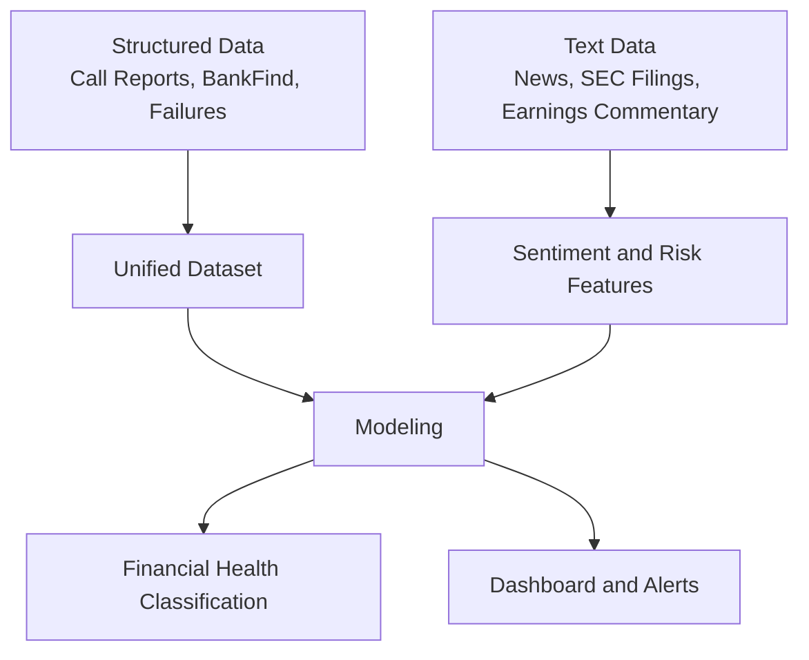
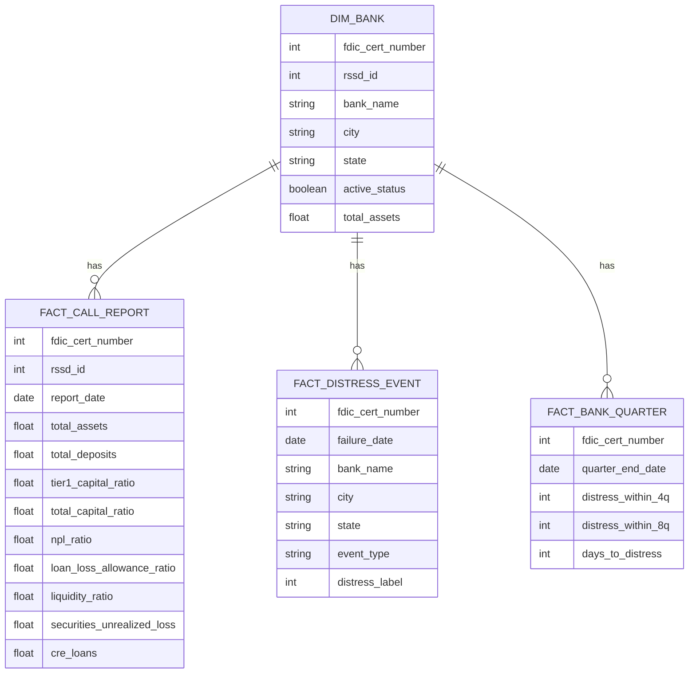
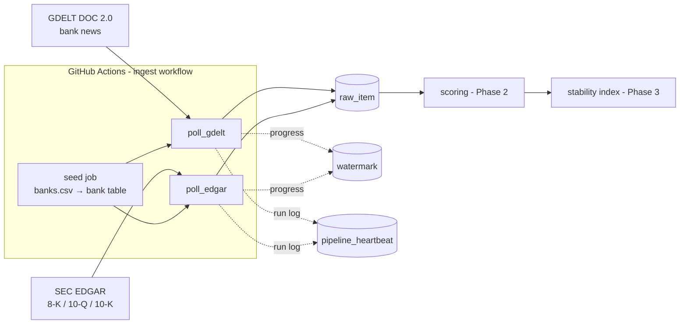

# Sentiment Analysis on Call Reports and Financial News for Active U.S. Banks

## Overview
This project builds a sentiment-driven early warning framework for active U.S. banks. It combines quarterly FFIEC Call Report fundamentals with public text signals such as financial news, SEC filings, and earnings commentary to classify bank financial health and highlight emerging risk narratives.

## Problem Statement
Quarterly filings update slowly, while public sentiment can shift quickly. The core question is whether text-based signals can improve early detection of bank distress beyond financial ratios alone.

## System Overview


## Unified Data Architecture
The project uses a bank-centric schema with a shared institution key and separate fact tables for fundamentals, events, and derived modeling views.



## Financial Health Classification
- Stable: fundamentals and sentiment remain within normal ranges.
- Watch: sentiment deteriorates or risk themes emerge without strong fundamental confirmation.
- Elevated Risk: sentiment decline aligns with weakening fundamentals.
- Imminent Disruption: strong negative sentiment combines with critical fundamentals or confirmed distress events.

## Repository Structure
- `unified_schema_dataset/`: local dataset build pipeline, schema, and populated tables.
- `unified_schema_dataset/scripts/`: scripts for FDIC refreshes, FFIEC Call Report ingestion, and derived modeling-table generation.
- `unified_schema_dataset/sql/schema.sql`: relational schema definition.
- `unified_schema_dataset/tables/`: generated CSV tables.

## Repo layout & ownership

```
├── unified_ffiec_fdic_dataset/  # FFIEC/FDIC unified dataset build (Shu Han)
├── db/                          # SQL migrations + bank crosswalk seed (this slice)
│   ├── migrations/
│   └── seed/
├── pipeline/                    # incremental pollers (GDELT, EDGAR) + db client (this slice)
│   └── loaders/                 # full loaders: FRED, yfinance, fundamentals (Phase 2+)
├── scoring/                     # FinBERT + Gemini hybrid scorer (Phase 2)
├── index/                       # stability index library + recompute CLI (Phase 3)
│   └── config/                  # index parameters as versioned YAML
├── dashboard/                   # Streamlit app (Phase 5)
├── evals/                       # eval harness (Phase 6)
│   ├── items/                   # gold set CSVs
│   └── prompts/                 # bake-off entries, one file per person
└── .github/workflows/           # ingest.yml (this slice)
```

- `unified_ffiec_fdic_dataset/` — FFIEC/FDIC structured dataset; owner: Shu Han.
- `db/` — Postgres migrations and the bank crosswalk seed; adding a bank is one seed row, zero code changes.
- `pipeline/` — incremental pollers (watermark + overlap window) and the thin DB client; `loaders/` will hold stateless full loaders (owner: TBD).
- `scoring/` — hybrid text scorer consuming `raw_item` status columns (owner: TBD).
- `index/` — stability index computation; parameters in `index/config/` YAML (owner: TBD).
- `dashboard/` — read-only Streamlit views (owner: TBD).
- `evals/` — gold-set evaluation harness and prompt bake-off (owner: TBD).

The table schema in `db/migrations/` is the **only shared contract** between
modules — modules communicate through those tables, never by importing each
other's code.

## Ingestion architecture

Everything meets in one Supabase Postgres database. GitHub Actions runs the
jobs; modules never import each other — they communicate only through the
shared tables defined in `db/migrations/`.



Four ideas explain the whole design:

**1. One landing table.** Every collected text item — news article or SEC
filing — becomes a row in `raw_item`, tagged with its `source` and the
`bank_id` it mentions. `UNIQUE (source, external_id, bank_id)` means
re-inserting something we already have is a silent no-op, so any run can be
safely repeated. Downstream phases (scoring, index) only ever read this
table; the `finbert_status` / `llm_status` columns are their work queue.

**2. Watermark + overlap.** Each (source, bank) pair remembers when it was
last polled (`watermark` table). The next run re-fetches from slightly
*before* that point (15 min for GDELT, 2 days for EDGAR) so nothing slips
through the crack between "published" and "indexed by the source" — and the
UNIQUE key throws away whatever the overlap re-fetched. This is why a poller
that crashes is self-healing: its watermark didn't move, so the next run
covers the same window again.

**3. Incremental pollers vs full loaders.** Sources that stream and won't
replay the past (news, filings, RSS) get an *incremental poller* in
`pipeline/` using the watermark pattern above. Sources that return their full
history every time (FRED, yfinance, fundamentals) will get a *stateless full
loader* in `pipeline/loaders/` that re-fetches everything and upserts into
its own table — no watermark, and it never writes `raw_item`.

**4. Failures are isolated but never silent.** A bad document only loses its
excerpt; a bad bank (broken query, wrong CIK) is skipped and retried next
run while the other banks continue; a bad source fails its own workflow job
while the other source keeps running (`fail-fast: false` matrix). At every
level the failure still surfaces: the run exits non-zero naming the failed
banks, and `pipeline_heartbeat` records `ok = false`. Check
`SELECT * FROM pipeline_heartbeat ORDER BY run_at DESC` before trusting the
data.

Day-to-day operations (applying migrations, secrets, adding a bank or a new
source) are step-by-step in `RUNBOOK.md` — adding a bank is one CSV row (§5),
adding a source touches four well-marked places (§6).

## Data Sources
- FFIEC Central Data Repository Call Reports
- FDIC BankFind Suite API
- FDIC Failed Bank List / failures endpoint
- Financial news and SEC filing sources to be integrated in later phases
