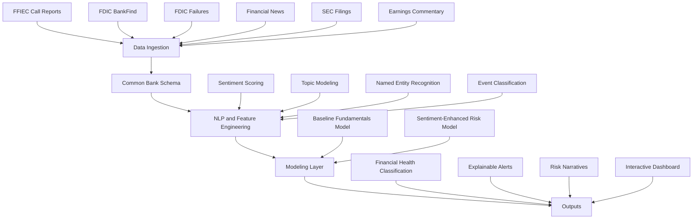
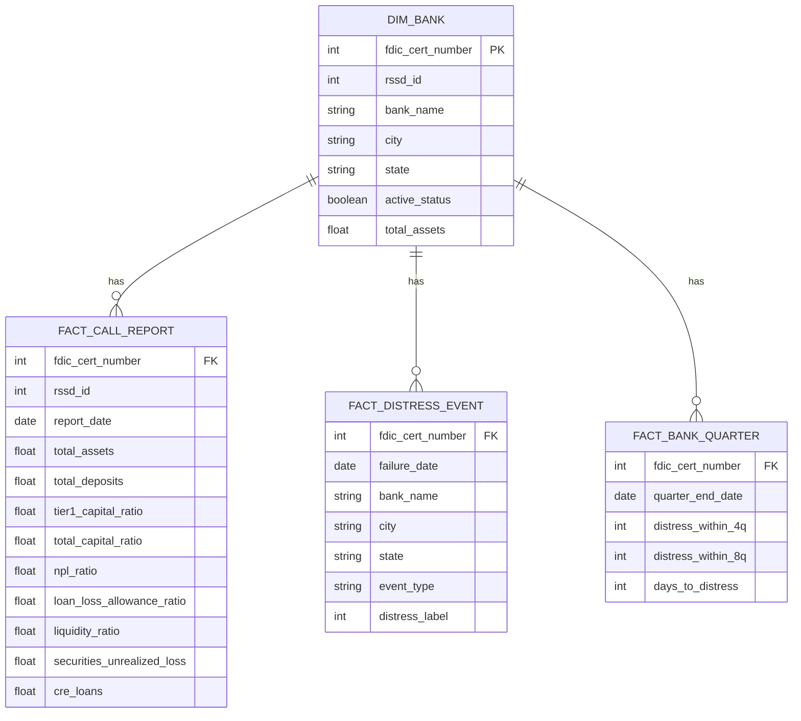
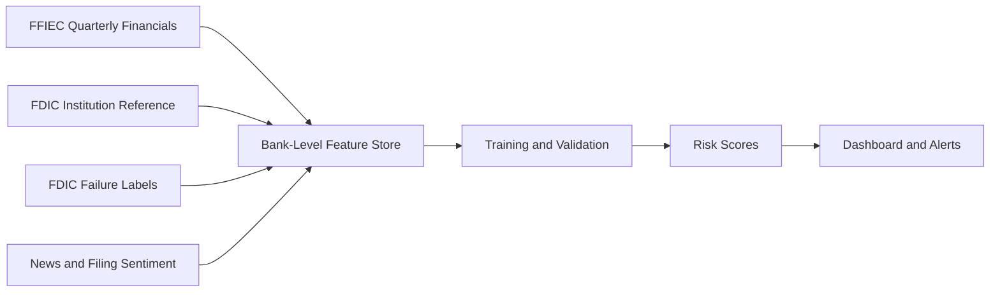

# Sentiment Analysis on Call Reports and Financial News for Active U.S. Banks

## Overview
U.S. commercial banks can deteriorate gradually through balance-sheet weakness or more suddenly through confidence shocks, liquidity pressure, adverse news, deposit flight, and market reaction. Traditional bank surveillance relies heavily on quarterly FFIEC Call Reports, which provide valuable structured financial data but arrive with a lag and may not fully capture fast-moving disruption.

This project proposes a real-time, sentiment-driven early warning analytics framework for active U.S. banks. It combines structured regulatory data from Call Reports with unstructured text sources such as financial news, SEC filings, earnings commentary, press releases, and other public signals. The goal is to test whether negative sentiment, topic shifts, and emerging risk narratives can provide earlier warning of bank disruption than quarterly financial ratios alone.

The working scope focuses on active FDIC-insured U.S. commercial banks above a defined asset threshold, such as $1 billion, to ensure consistent data availability. For each bank, the system aligns quarterly fundamentals with daily or weekly sentiment indicators and uses those signals to classify financial health and surface explainable risk narratives.

## Problem Statement
Traditional bank monitoring has a timing gap: quarterly regulatory filings update slowly, while confidence and public perception can change quickly. This project asks whether unstructured sentiment can complement structured Call Report fundamentals to detect emerging distress earlier and more interpretably.

Primary objective: build a pipeline that ingests regulatory financials and text-based signals, extracts sentiment and risk themes, and outputs a classification of financial health for each bank.

## System Overview

## Unified Data Architecture
The project uses a bank-centric schema with a shared institution key and separate fact tables for fundamentals, events, and derived modeling views.

## Modeling Approach
The modeling framework uses a layered design:

- Baseline layer: quarterly Call Report fundamentals such as capital adequacy, asset quality, liquidity, earnings, and commercial real estate exposure.
- Signal layer: daily or weekly sentiment indicators from news, filings, and earnings commentary that update the baseline risk estimate.
- Output layer: bank-level financial health classification with interpretable alerting.

Proposed modeling methods include logistic regression, XGBoost, time-series classification, survival analysis, and Bayesian updating.

## Financial Health Classification
- Stable: fundamentals and sentiment remain within normal ranges.
- Watch: sentiment deteriorates or risk themes emerge without strong fundamental confirmation.
- Elevated Risk: sentiment decline aligns with weakening fundamentals.
- Imminent Disruption: strong negative sentiment combines with critical fundamentals or confirmed distress events.

## Example Data Flow

## Research Questions
1. Do negative financial news sentiment signals provide measurable lead time before formal bank distress events?
2. Which sentiment sources are most predictive: financial news, SEC 8-K filings, earnings transcripts, or market commentary?
3. Does sentiment improve prediction performance when combined with quarterly Call Report fundamentals?
4. Can topic-specific sentiment, such as liquidity stress or capital weakness, outperform general positive/negative sentiment?
5. How can a real-time dashboard present sentiment alerts responsibly without creating misleading or alarmist conclusions?

## Expected Deliverables
1. A curated bank-level dataset aligned to a unified common schema.
2. A reproducible NLP pipeline for sentiment and topic extraction.
3. Bank-time sentiment and topic feature sets.
4. Predictive modeling experiments comparing baseline and enhanced models.
5. A real-time scoring and monitoring framework.
6. An interactive dashboard with explainable alerts.
7. A written research report documenting methods, results, ethics, and limitations.

## Research Value
This project addresses a major limitation in traditional bank monitoring: the lag between quarterly regulatory filings and rapidly changing market confidence. It extends early warning frameworks by treating public sentiment as a measurable, fast-moving risk signal while remaining grounded in public data and academic research objectives.

## Ethical Considerations and Limitations
- Sentiment signals can be noisy and should be framed as indicators rather than accusations.
- Entity matching across banks, holding companies, and tickers is nontrivial.
- Bank failures are rare, so class imbalance and calibration are important.
- News coverage varies by institution size and geography.
- Regulatory filings remain lagged even when sentiment is real time.

## Repository Structure
- `unified_schema_dataset/`: local dataset build pipeline, schema, and populated tables.
- `unified_schema_dataset/scripts/`: scripts for FDIC refreshes, FFIEC Call Report ingestion, and derived modeling-table generation.
- `unified_schema_dataset/sql/schema.sql`: relational schema definition.
- `unified_schema_dataset/tables/`: generated CSV tables.

## Data Sources
- FFIEC Central Data Repository Call Reports
- FDIC BankFind Suite API
- FDIC Failed Bank List / failures endpoint
- Financial news and SEC filing sources to be integrated in later phases
