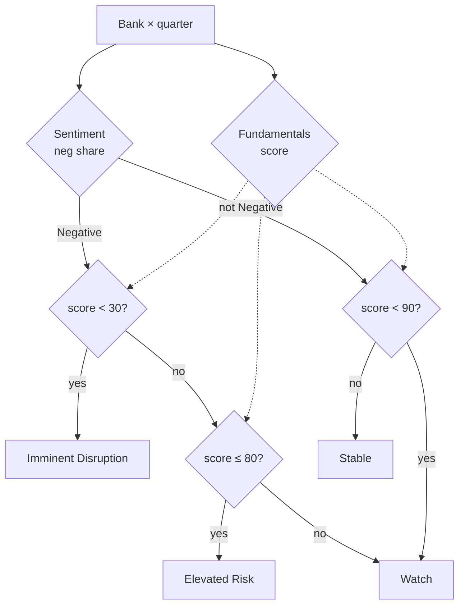
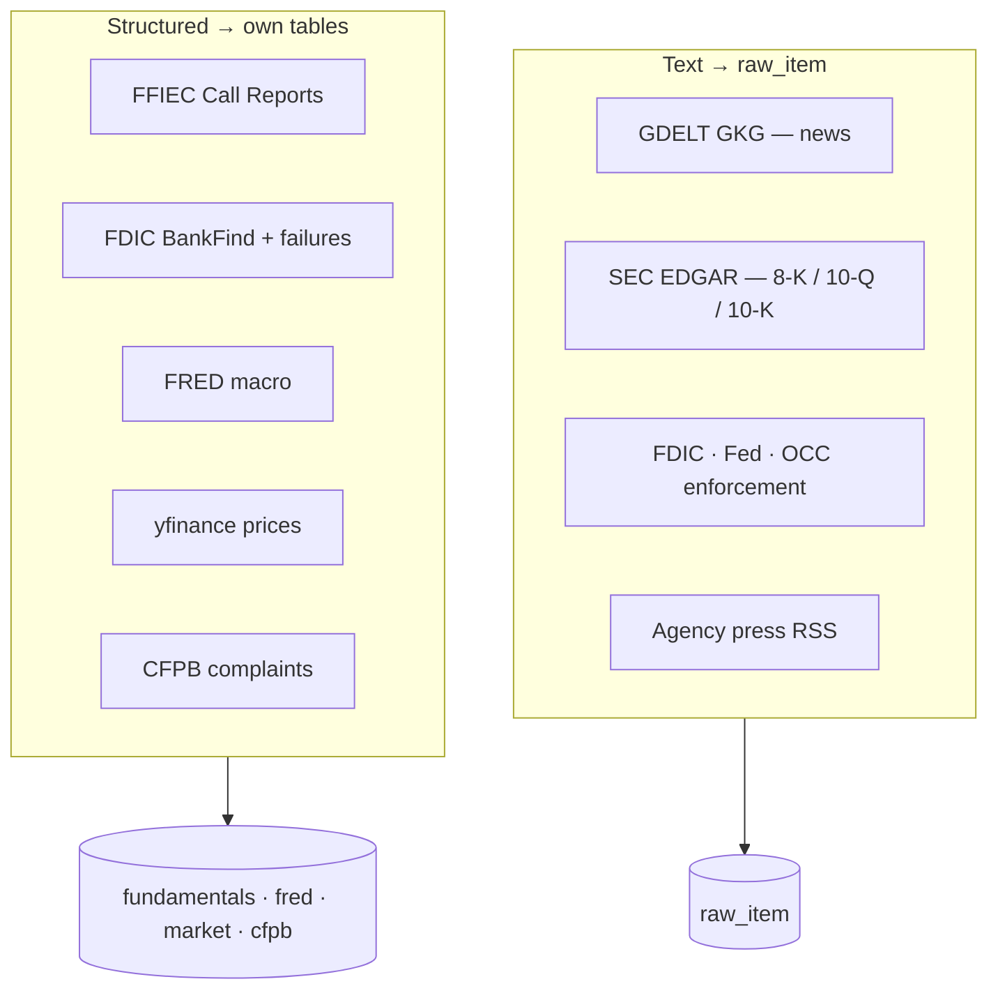
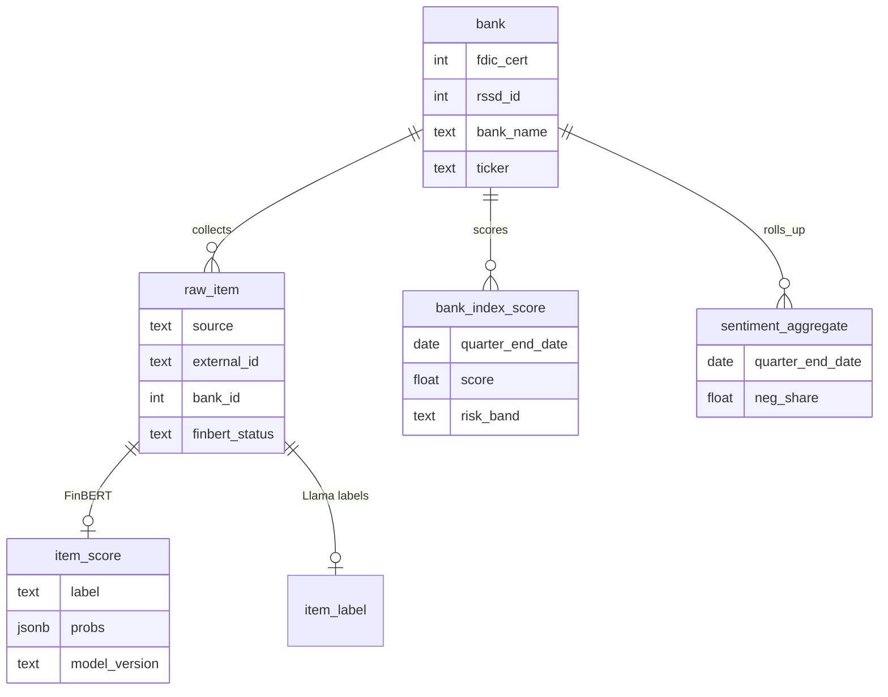

# Bank Distress Early Warning

Combines **FFIEC Call Report fundamentals** with **public text signals** (news, SEC filings, enforcement actions) to flag emerging bank risk before quarterly filings catch up.

> Can text sentiment improve early distress detection beyond ratios alone? **Yes — on first combined backtest** the four-tier ladder beats both axes alone ([report](evals/reports/2026-08-14_combined_ladder.md)).

## End-to-end flow

```mermaid
flowchart LR
    subgraph INGEST[Ingest — GitHub Actions]
        P1[poll_gkg · poll_edgar<br/>enforcement · agency RSS]
        L1[loaders: FRED · yfinance<br/>fundamentals · CFPB]
    end

    subgraph DB[(Supabase Postgres)]
        RAW[(raw_item)]
        FUND[(fundamentals<br/>bank_index_score)]
        SENT[(sentiment_aggregate)]
    end

    subgraph SCORE[Scoring]
        FB[FinBERT fine-tune<br/>finbert-ft-2026-08-09]
        ATTR[attribution gate]
        AGG[quarterly rollup]
    end

    subgraph INDEX[Fundamentals axis]
        GP[GP classifier<br/>gp50@fixed · 50 features]
    end

    subgraph OUT[Outputs]
        COMB[combine_axes<br/>four-tier ladder]
        BT[evals/backtest.py]
        DASH[dashboard — planned]
    end

    P1 --> RAW
    L1 --> FUND
    RAW --> FB --> ATTR --> AGG --> SENT
    FUND --> GP
    GP --> FUND
    FUND --> COMB
    SENT --> COMB
    COMB --> BT
    COMB -.-> DASH
```

## Two axes → one ladder

Each bank-quarter gets a **fundamentals score** (0–100, GP over Call Report features) and a **sentiment profile** (FinBERT 3-class labels rolled up per quarter). A rule ladder — not a weighted blend — assigns the health tier:


```mermaid
flowchart TD
    A[Bank × quarter] --> B{Fundamentals<br/>score}
    A --> C{Sentiment<br/>neg share}

    C -->|Negative| D{score < 30?}
    D -->|yes| T4[Imminent Disruption]
    D -->|no| E{score ≤ 80?}
    E -->|yes| T3[Elevated Risk]
    E -->|no| T2[Watch]

    C -->|not Negative| F{score < 90?}
    F -->|yes| T2
    F -->|no| T1[Stable]

    B -.-> D
    B -.-> E
    B -.-> F
```

| Tier | Rule (defaults) |
|---|---|
| **Imminent Disruption** | score < 30 **and** sentiment negative |
| **Elevated Risk** | score ≤ 80 **and** sentiment negative |
| **Watch** | sentiment negative **or** score < 90 |
| **Stable** | otherwise |

No sentiment → fundamentals-only, capped at Elevated Risk. Details: [`pipeline/combine_axes.py`](pipeline/combine_axes.py).

## Data sources


```mermaid
flowchart TB
    subgraph TEXT[Text → raw_item]
        GKG[GDELT GKG — news]
        EDGAR[SEC EDGAR — 8-K / 10-Q / 10-K]
        ENF[FDIC · Fed · OCC enforcement]
        RSS[Agency press RSS]
    end

    subgraph STRUCT[Structured → own tables]
        FFIEC[FFIEC Call Reports]
        FDIC[FDIC BankFind + failures]
        FRED[FRED macro]
        YF[yfinance prices]
        CFPB[CFPB complaints]
    end

    TEXT --> RAW[(raw_item)]
    STRUCT --> TBL[(fundamentals · fred · market · cfpb)]
```

104 seed banks in [`db/seed/banks.csv`](db/seed/banks.csv). All text items land in one table; `UNIQUE (source, external_id, bank_id)` makes every poller idempotent. Watermark + overlap windows keep incremental runs self-healing — see [`RUNBOOK.md`](RUNBOOK.md).

## Schema (shared contract)

Modules communicate through Postgres tables in [`db/migrations/`](db/migrations/), never by importing each other's code.


```mermaid
erDiagram
    bank ||--o{ raw_item : collects
    bank ||--o{ bank_index_score : scores
    raw_item ||--o| item_score : "FinBERT"
    raw_item ||--o| item_label : "Llama labels"
    bank ||--o{ sentiment_aggregate : rolls_up

    bank {
        int fdic_cert
        int rssd_id
        text bank_name
        text ticker
    }
    raw_item {
        text source
        text external_id
        int bank_id
        text finbert_status
    }
    item_score {
        text label
        jsonb probs
        text model_version
    }
    bank_index_score {
        date quarter_end_date
        float score
        text risk_band
    }
    sentiment_aggregate {
        date quarter_end_date
        float neg_share
    }
```

## Repo layout

```
├── unified_ffiec_fdic_dataset/   # FFIEC/FDIC panel + distress labels (Shu Han)
├── db/migrations/                # Postgres schema — the only cross-team contract
├── pipeline/                     # pollers, loaders, FinBERT scoring, axis combination
├── scoring/                      # labeling design, quality gate, FinBERT training
├── index/fundamentals/           # GP fundamentals axis (Ming)
├── evals/                        # distress backtest + sentiment gold set
├── dashboard/                    # Streamlit UI — concept only
├── eda/                          # exploratory analysis + charts
└── .github/workflows/            # ingest · score · index-score · loaders · CI
```

| Module | Status | Docs |
|---|---|---|
| Ingest pollers | Live (6 sources) | [`RUNBOOK.md`](RUNBOOK.md) · [`DATA_SOURCES.md`](DATA_SOURCES.md) |
| FinBERT scoring | Live (CI + Kaggle backlog) | [`scoring/DESIGN.md`](scoring/DESIGN.md) |
| Fundamentals axis | Live (`gp50@fixed`) | [`index/fundamentals/README.md`](index/fundamentals/README.md) |
| Combined ladder | Live | [`evals/reports/2026-08-14_combined_ladder.md`](evals/reports/2026-08-14_combined_ladder.md) |
| Dashboard | Concept | [`dashboard/README.md`](dashboard/README.md) |

## Backtest snapshot

Intersected test window 2022–2024, 1,245 bank-quarters, 32 distress positives ([`distress_bank_quarter_full.csv`](evals/items/distress_bank_quarter_full.csv)):

| Model | PR-AUC | recall@budget=10 |
|---|---:|---:|
| **Combined ladder** | **0.081** | **9–10 / 32** |
| Fundamentals only | 0.059 | 8 / 32 |
| Sentiment only | 0.043 | 6 / 32 |

Full protocol: [`evals/backtest_protocol.md`](evals/backtest_protocol.md). Fundamentals-only comparison: [`evals/reports/2026-08-07_fair_vs_gp50.md`](evals/reports/2026-08-07_fair_vs_gp50.md).

## Quick start

```bash
pip install -r requirements.txt
python3 -m pytest tests/ -q          # 171+ tests
python3 evals/backtest.py --smoke    # harness sanity check
```

Operations (migrations, secrets, adding a bank or source): [`RUNBOOK.md`](RUNBOOK.md).
