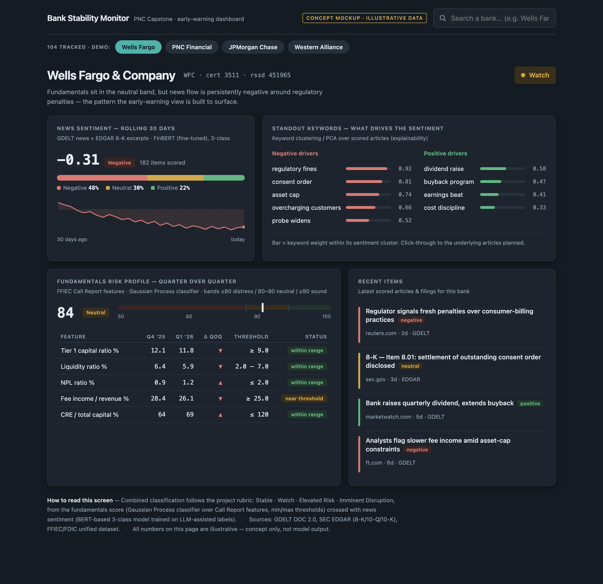
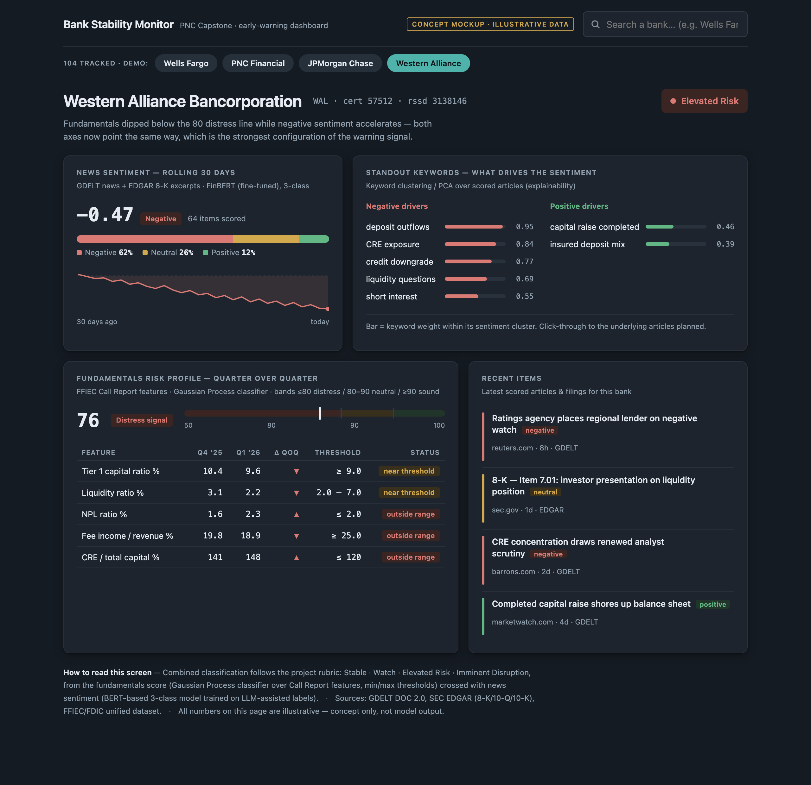

# dashboard — Bank Stability Monitor (Streamlit)

`app.py` is a one-page early-warning dashboard for bank distress: pick a
bank, see a composite Stable / Watch / Elevated Risk read, then the
evidence and model explanation behind it.

## Run it

```
pip install -r requirements.txt
```

Needs `SUPABASE_DB_URL` set (`.env` in the repo root, loaded via
`python-dotenv`) — the app reads several tables live at startup.

```
streamlit run dashboard/app.py
```

Opens at `http://localhost:8501`.

## Reading the page, top to bottom

1. **Bank picker + header** — the composite **Stable / Watch / Elevated
   Risk** badge. Driven by fundamentals × sentiment only (see Design note below).
2. **Key Alerts** — metrics outside their regulatory threshold, plus
   non-ratio flags (e.g. open enforcement actions). Informational — not
   itself part of the composite score.
3. **Fundamentals Risk Profile** + **Model Feature Drivers**, side by side —
   the model's verdict and *why* it reached it, kept adjacent on purpose:
   - Fundamentals Risk Profile: the GP (Gaussian Process) score, its
     Sound/Neutral/Distress band, and trend.
   - Model Feature Drivers: real local attribution for that score — the
     frozen `gp50_prod_v1` model, refit and re-scored with each feature
     swapped to this quarter's peer average one at a time. The shift in
     `distress_prob` each swap causes is that feature's contribution; the
     table shows the top 5 by absolute effect on *this* bank, not by the
     model's global feature-gain ranking.
4. **Metric Breakdown** — the raw CAMELS-style evidence (Capital, Credit
   Quality, Liquidity, Profitability) backing the score above, filterable.
5. **Sentiment** + **Keywords / Recent Items**, side by side — 3-class
   news sentiment, its trend, the standout keywords driving it, and the
   recent scored items. See Status below — this panel is not live yet.
6. **Footer caption** — a compact repeat of this reading guide plus the
   full source list, always visible on the page itself.

## What's real vs. illustrative

The page has one `CONCEPT MOCKUP · ILLUSTRATIVE DATA` badge, but that's no
longer uniformly true — some panels now read live tables:

| Panel | Source | Status |
|---|---|---|
| Fundamentals Risk Profile (score, band, trend) | `bank_index_score` | Real |
| Metric Breakdown | `fact_call_report` | Real |
| Model Feature Drivers | `bank_index_feature` + refit `gp50_prod_v1` | Real |
| Sentiment, Keywords, Recent Items | — | **Mock.** `item_score` (the table a real score would live in) has no writer yet — no serving batch has been built to run the trained FinBERT model against new items. Most demo banks show `None`/placeholder here. |
| `summary` text, `alerts` | — | Illustrative — hand-written per demo bank. |

## Concept renderings

Original first-screen concept (mentor discussion, 2026-07-12) — illustrative
design artifacts, not model output, kept for reference against the built page:

**Watch state** — fundamentals neutral, sentiment negative (Wells Fargo demo):



**Elevated Risk state** — both axes negative at once, the strongest
configuration of the warning signal (Western Alliance demo):



- Reads: `bank_index_score`, `bank_index_feature`, `fact_call_report`
  (read-only; schema in `db/migrations/` is the shared contract)
- Writes: nothing
