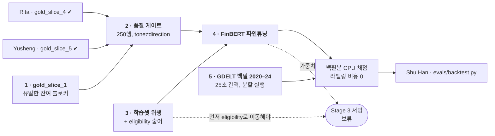

# 역할 가이드 — Jiwon: 라벨링 + FinBERT

> 영어 원본: [jiwon.md](jiwon.md) — 두 문서가 어긋나면 영어본이 기준.

> 담당: `scoring/`의 Stage 1(라벨링 / 품질 게이트)과 Stage 2(파인튜닝),
> 그리고 백테스트에 채점할 대상을 만들어주는 과거 GDELT 백필.

## 의존성 그래프

슬라이스 2~5는 전부 `main`에 있다(200행). **`gold_slice_1`이 게이트 앞의
유일한 잔여물**이고 그건 내 것이다 — 기다릴 사람이 없다.

3번과 5번은 **게이트 뒤가 아니다** — 술어와 백필은 슬라이스가 리뷰 중일
때도 돌릴 수 있다. 기다리는 건 2번과 4번뿐이다.

## 순서

Stage 2는 Stage 1에 틀리기 쉬운 방식으로 걸려 있다: 학습셋은 **champion**
라벨러의 행이고, champion은 품질 게이트가 정한다. 게이트가 실패하면 프롬프트
수정 → 재라벨링이고 그러면 라벨이 전부 바뀐다. 게이트가 결론 나기 전에
학습하면 그 학습을 버리게 된다.

### 1. `gold_slice_1` 라벨링 — 50행

완료 (커밋 `ed21875`). 5 × 50 휴먼 검증셋 중 내 몫이었다. 게이트 계산도
완료 — `evals/gate_report_2026-08-07.md` 참고.

### 2. 품질 게이트 계산

슬라이스 4(Rita)·5(Yusheng)가 `main`에 들어왔으므로 250행이 모두 존재한다.

- `llama_kaggle` 대비 클래스별 불일치
- 임계값 placeholder: 전체 ≥85%, 모든 클래스 ≥75% — **팀 확정 필요**
- **tone ≠ direction 으로 층화할 것.** 이게 이 작업의 핵심이다. FinBERT는
  금융 *tone*으로 프리트레인됐지만 우리 타겟은 *리스크 방향*이고, 둘은
  라벨링 가이드가 가장 가치있다고 표시한 완곡어법 케이스에서 정확히 갈린다 —
  "exploring strategic alternatives"(차분한 톤, negative), "consent order
  lifted"(규제 표현, positive). 전체 통과율이 바로 그 행들의 실패를 가릴 수
  있다.
- ⚠️ **클래스 불균형에 주의.** 250행 전체에서 neutral 229 / positive 14 /
  negative 7이다. `negative` 클래스별 일치율은 **7행 위에 서 있다** — 그
  숫자 하나로 게이트를 판정하지 말 것. 이것이 Yusheng의 슬라이스 6~9가
  존재하는 이유다.

게이트 실패 시: 프롬프트 수정 → 재라벨링, 그래도 실패하면 Gemini challenger
검토.

### 3. 학습셋 위생

**학습셋을 조립하는 시점**의 필터 — `eligibility` 변경도, 재export도,
재라벨링도 없다:

| 부류 | 행수 | 방향 라벨 | 조치 |
|---|---|---|---|
| 무내용 EDGAR (10-Q / 10-K/A, excerpt 없음) | 107 | 0 | 제외 — 퇴화 패턴, 전부 `neutral` |
| 지분 / 13F 와이어 스팸 | 723 | 51 | 제외 — 방향이 다른 회사 것 |
| 등급 / 목표주가 템플릿 | 375 | 123 | **일단 유지** — 같은 표면형이 정반대 역할을 담음 |

`eligibility` 술어 두 개도 마무리한다. 학습과 서빙 양쪽을 게이팅하기
때문이다:

- `is_syndication_noise` — **목적어로 두 번째 엔티티**가 있을 때만 발화해야
  한다. 단순한 `Upgrad|Downgrad` 항은 은행 *자신의* 등급 변동까지 잡는다
  ("Commerce Bancshares Downgraded by Wall Street Zen to Sell" — 정당한
  `negative`, gold slice에서 확인됨).
- EDGAR 빈 `text_excerpt` → `eligible=False, reason="empty_text"`. EDGAR
  title은 `"{holding_name} {form}"`으로 합성돼 절대 비지 않으므로 기존
  가드가 발화하지 않는다.
- **보일러플레이트만 있는 8-K가 세 번째 부류다.** `gold_slice_1` 라벨링 중
  발견: `"First Financial Bancorp. 8-K"`와 `"TriCo Bancshares 8-K"`는
  excerpt가 길고 비어 있지 않지만 전부 SEC 표지다 — 주소, 전화번호,
  Rule 425 / 14a-12 체크박스, 등록 증권 표 — 사건 텍스트가 없다. 빈 값
  검사로는 안 잡힌다. 술어를 "excerpt가 비었는가"에서 "표지 이후 본문이
  있는가"로 넓힌다. 무내용 10-Q 107행과 같은 퇴화 패턴이다 — 읽을 게 없으니
  모든 라벨러가 `neutral`을 쓴다.

⚠️ 두 술어 모두 **Stage 3 서빙이 나가기 전에** `eligibility`로 옮겨야 한다.
학습에서만 걸러내고 서빙은 계속 채점하면, 공유 필터가 막으려는 바로 그
train/serve skew가 생긴다.

### 4. FinBERT 파인튜닝

Kaggle GPU, 라벨링 배치와 같은 환경.

- 학습셋: champion 라벨러의 `item_label` 행, 둘 다 있는 곳에서는 `human`
  행이 우선
- **시간 기반** train/validation 분할 (무작위 아님) — 서빙 현실과 일치하고,
  신디케이션 준중복이 분할을 넘나드는 것을 막는다
- 홀드아웃에서 accuracy + 클래스별 F1을 **pretrained-only FinBERT
  베이스라인과 비교해** 보고. 그 비교가 없으면 파인튜닝이 뭔가 했다는 증거가
  없다
- 가중치 호스팅 결정(Kaggle 데이터셋 vs HF hub), 각 행을 어떤 가중치가
  채점했는지 `item_score.model_version`에 기록

### 5. GDELT 백필, 2020~2024

실측된 문제: 부실 사건은 2017~2024년에 걸쳐 있고 가장 최근이 2024-12-31인데,
GDELT 코퍼스는 2026-04-13에 시작한다. **겹치는 구간 0** — 이게 없으면
백테스트에 채점할 과거가 없다.

- 시드 104곳, 은행 확장 없음 (프로브 결과 $10B 미만 은행은 사실상 뉴스가
  없다; Heartland Tri-State는 망한 해에 영어 기사 5건)
- 2020~2024가 33건 중 24건을 커버
- 약 14만 행 예상
- **요청 간격은 현재 8초가 아니라 약 25초여야 한다.** 사이징 프로브에서
  8초로는 6곳 중 2곳이 429를 맞았고, 25초에서는 즉시 성공했다. 25초면 약
  15시간이므로 Actions 잡으로 분할할 것 — 잡당 제한은 6시간
- **이 행들은 라벨링하지 않는다.** 파인튜닝된 FinBERT가 CPU로 채점한다.
  백필 규모는 Kaggle 라벨링 예산에 전혀 영향이 없다

## 내가 소유하지 않는 것

- `evals/backtest.py`와 지표 프로토콜 — Shu Han
- 부실 이벤트 정의 — Shu Han, Ming과 함께
- Stage 3 서빙 하네스 — 가중치가 나올 때까지 보류. pretrained로 지금
  배선하면 두 번 쓰게 된다

## 참고 문서

- `scoring/DESIGN.ko.md` — 단계, 계약, 결정 로그 (영어본 `DESIGN.md`가 기준)
- `scoring/labeling_guide.ko.md` — 휴먼 라벨이 따르는 규칙
- `evals/prompts/jiwon_llama.md` — 라벨링 프롬프트 (v2)
- `pipeline/eligibility.py` — 두 단계가 공유하는 필터
