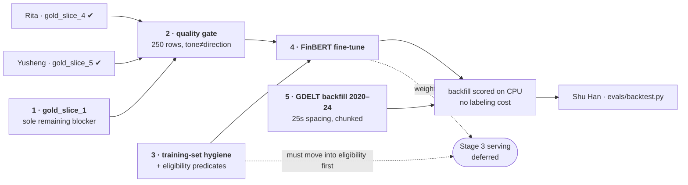

# Role guide — Jiwon: labeling + FinBERT

> Owns: Stage 1 (labeling / quality gate) and Stage 2 (fine-tuning) of
> `scoring/`, plus the historical GDELT backfill that gives the backtest
> something to score.

## Dependency graph

Slices 2–5 are all on `main` (200 rows). **`gold_slice_1` is the only thing
left before the gate**, and it is mine — no one else to wait on.

Tasks 3 and 5 are **not** behind the gate — the predicates and the backfill can
run while slices 4 and 5 are still in review. Only tasks 2 and 4 wait.

## Sequence

Stage 2 depends on Stage 1 in a way that is easy to get wrong: the training set
is the **champion** labeler's rows, and the quality gate decides who the
champion is. If the gate fails, the fix is prompt revision → re-labeling, which
changes every label. Training before the gate concludes risks throwing that
training away.

### 1. Label `gold_slice_1` — 50 rows

Done (commit `ed21875`). This was my share of the 5 × 50 human verification
set. The gate itself is computed too — see `evals/gate_report_2026-08-07.md`.

### 2. Compute the quality gate ✔ done 2026-08-07

`pipeline/quality_gate.py` → `evals/gate_report_2026-08-07.md`, over all 300
rows (slices 1–6). What it found, and what changed as a result:

- The **≥85% threshold is retired**: 91.6% of human labels in the random
  sample are `neutral`, so a do-nothing labeler beats it. Read the gate as
  kappa (0.473 random / 0.564 pooled) and macro-F1 instead.
- **`negative` precision 13/36 = 36.1%** is the finding that matters — it held
  at 37.5% on 16 rows and 36.1% on 36, so it is structural. The hygiene
  filters remove **0** of those 21 mislabels; 11 are bank-as-analyst rating
  rows. It is a prompt defect, and it sits on the 186 `negative` training rows.
- Acceptance criteria for the next run are fixed in `quality_gate.CRITERIA`,
  paired precision-with-recall so the fix cannot be gamed.
- Gold rows are now split dev (1, 3, first half of 6) / holdout (2, 4, 5,
  second half of 6). Tune prompts on dev only.

Next: run prompt v3 (`evals/prompts/jiwon_llama_v3.md`) over
`labeling_batch_gold300.csv` on Kaggle — upload `pipeline/kaggle_llama_labeling.ipynb`,
attach the CSV as a private dataset, Run All — then re-score locally with
`pipeline.quality_gate` and only relabel all 8,360 rows if the criteria clear.

Original task description

Once slices 4 (Rita) and 5 (Yusheng) land on `main`, all 250 rows exist.

- Per-class disagreement vs `llama_kaggle`
- Placeholder thresholds: ≥85% overall, ≥75% every class — **the team still has
  to confirm these**
- **Stratify by tone ≠ direction.** This is the point of the whole exercise.
  FinBERT is pretrained on financial *tone* while our target is *risk
  direction*, and they diverge exactly on the euphemism cases the labeling
  guide flags as most valuable — "exploring strategic alternatives" (calm tone,
  negative), "consent order lifted" (regulator language, positive). An overall
  pass rate can hide failure on precisely those rows.
- ⚠️ **Mind the class imbalance.** Across all 250 rows: 229 neutral, 14
  positive, 7 negative. Per-class agreement for `negative` rests on **seven
  rows** — do not decide the gate on that number alone. Slice 6 was built to
  fix exactly this, and did: `negative` went 7 → 14 human rows and 16 → 36
  llama rows, which is what turned the 36% precision reading from a suspicion
  into a measurement.

If the gate fails: revise the prompt, re-label, and only then consider standing
up the Gemini challenger.

### 3. Training-set hygiene — filters ✔, `eligibility` predicates still open

Implemented in `pipeline/export_training_set.py`; counts re-measured
2026-08-07 against the 2026-07-22 batch:

| Class | Rows | Directional | Action |
|---|---|---|---|
| Contentless EDGAR (10-Q / 10-K/A, no excerpt) | 107 | 0 | exclude — degenerate, all `neutral` |
| Holdings / 13F wire spam | **983** | 43 | exclude — the direction belongs to another company |
| Rating / price-target templates | 571 | 157 | **keep for now** — same surface form covers both roles |
| Duplicate titles | 385 | — | exclude — leakage |
| Human holdout stratum | 132 | 20 | exclude from train/val, written as its own CSV |

The spam predicate is now structural (two-entity templates only), which is why
it reads 983 rather than the earlier 723 estimate; overlap with the rating
class measured zero.

Still to do — the two `eligibility` predicates, since they gate both this and
serving:

- `is_syndication_noise` — must fire only when a **second entity** is the
  object. A bare `Upgrad|Downgrad` term also catches a bank's *own* rating
  change ("Commerce Bancshares Downgraded by Wall Street Zen to Sell" — a
  legitimate `negative`, confirmed in a gold slice).
- EDGAR empty `text_excerpt` → `eligible=False, reason="empty_text"`. EDGAR
  titles are synthesized as `"{holding_name} {form}"` and are never empty, so
  the existing guard never fires.
- **Boilerplate-only 8-K excerpts are a third class**, found while labeling
  `gold_slice_1`: `"First Financial Bancorp. 8-K"` and `"TriCo Bancshares
  8-K"` have long, non-empty excerpts that are entirely the SEC cover page —
  address, phone number, the Rule 425 / 14a-12 checkboxes, the
  registered-securities table — with no event text. An emptiness check will
  not catch it. Widen the predicate from "is the excerpt empty" to "is there
  body text past the cover page". Same degenerate pattern as the 107
  contentless 10-Q rows: nothing to read, so every labeler writes `neutral`.

⚠️ Both predicates must move into `eligibility` **before Stage 3 serving
ships**. Filtering only at training time while serving keeps scoring those rows
creates exactly the train/serve skew the shared filter exists to prevent.

### 3b. Relabel the corpus with the champion ✔ done 2026-08-09

The champion is a **per-class ensemble**: `negative` from prompt v4, everything
else from v3 (`labels_ensemble_full.csv`). Both prompts were run over all
8,360 rows; each reproduced its 300-row pilot exactly, so the runs are
deterministic. The ensemble beats either parent — kappa 0.683, macro-F1 0.828,
`negative` 0.923 precision / 0.857 recall — and holds up on the holdout alone
(0.833 / 0.833 vs v3's 1.000 / 0.667), so it is not fitted to the dev rows.

It still misses `positive` recall (0.676 against 0.70) and is used anyway; see
`scoring/DESIGN.md` § "Training on a champion that missed the criteria".

**Known limitation, accepted deliberately.** The training set carries **38**
`negative` rows. v2's 186 were mostly wrong (precision 0.361); correct
labeling of a 2026-only corpus simply does not yield more. Labeling the
2020-2024 backfill would, but it would break the leak-free separation between
training data and the backtest window, so it was rejected. Do not report the
model's `negative` F1 as evidence about distress detection — neither the 38
training rows nor the 6 in the holdout can support that claim.

### 4. Fine-tune FinBERT — scripts ✔, run still blocked on the relabel

`pipeline/kaggle_finbert_train.py` is written: pretrained-baseline comparison,
inverse-frequency class weights, val and human-holdout reported separately.
`export_training_set.py` produces train 5,280 / val 1,473 / holdout 132.

**Do not run it on the v2 labels.** Not because of the rule that Stage 2 waits
on the gate, but because the run could not be interpreted: validation labels
come from the same labeler, so a strong `negative` F1 would mean the model
reproduced a 36%-precision error faithfully, and a weak one confounds label
noise with class scarcity and FinBERT's tone prior. Relabel first.

- Training set: champion labeler's `item_label` rows, with `human` rows
  overriding where both exist
- **Time-based** split in days (default 3), not weeks — GDELT went live
  2026-07-09 so a two-week holdout swallows 82% of the corpus
- Report accuracy + per-class F1 on **both** val and the human holdout,
  **against a pretrained-only FinBERT baseline**. Without that comparison
  there is no evidence fine-tuning did anything; without the holdout there is
  no evidence it is *right*, only that it agrees with Llama
- Decide weight hosting (Kaggle dataset vs HF hub) and record which weights
  scored each row in `item_score.model_version`

### 5. GDELT backfill, 2020–2024

Measured problem: our distress events run 2017–2024 and the most recent is
2024-12-31, while the GDELT corpus starts 2026-04-13. **Zero overlap** — the
backtest has no scorable history without this.

- 104 seed banks, no bank-set expansion (probe showed sub-$10B banks have
  essentially no news; Heartland Tri-State produced 5 English articles in the
  year it failed)
- 2020–2024 covers 24 of the 33 distress events
- ~140k rows expected
- **Request spacing must be ~25s, not the current 8s.** The sizing probe hit
  429s on 2 of 6 banks at 8s and succeeded immediately at 25s. At 25s the run
  is ~15 hours, so chunk it across Actions jobs — the per-job limit is 6h
- **These rows are not labeled.** The fine-tuned FinBERT scores them on CPU.
  Backfill volume does not touch the Kaggle labeling budget at all

## What I do not own

- `evals/backtest.py` and the metric protocol — Shu Han
- The distress event definition — Shu Han, with Ming
- Stage 3 serving harness — deferred until the weights exist; wiring it against
  pretrained weights now means writing it twice

## Reference

- `scoring/DESIGN.md` — stages, contracts, decision log; `DESIGN.ko.md` is the
  Korean translation and English is canonical
- `scoring/labeling_guide.md` — the rules the human labels follow
- `evals/prompts/jiwon_llama.md` — the labeling prompt (v2)
- `pipeline/eligibility.py` — the shared filter both stages call
