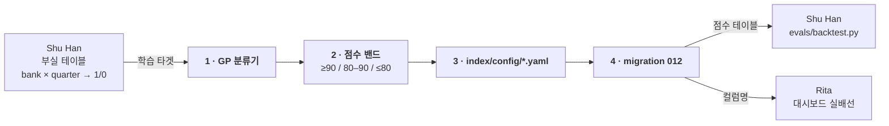

# 역할 가이드 — Ming: `index/` fundamentals 축

> 영어 원본: [ming.md](ming.md) — 두 문서가 어긋나면 영어본이 기준.

> 담당: Call Report 숫자를 **은행 × 분기 리스크 점수**로 바꾸는 일.
> 프로젝트가 결합하는 두 축 중 하나다. 이게 없으면 감성 축은 비교할 상대가
> 없다.

## 의존성 그래프

입력 하나에 막히고, 두 사람을 막는다. **두 간선 다 코드가 아니라
"컬럼명"** 이다 — 대화로 확정하면 나머지는 병렬로 돈다.

Rita는 mock을 벗어나는 데 **이름만** 필요하다 — 당신 모델이 동작할 필요가
없다. `012`가 머지될 때가 아니라 **초안이 나온 즉시** 알려줄 것.

## 왜 중요한가

최종 주장은 "텍스트 신호가 **재무 비율만 쓸 때보다** 낫다"이다. 당신의
점수가 곧 "재무 비율만" 쪽이다. 이게 약하면 비교는 양방향으로 무의미해진다
— 망가진 베이스라인을 이긴 감성 모델은 아무것도 증명하지 못한다.

## 선행 작업 — Shu Han과 타겟 합의

Shu Han이 **은행 × 분기 → 부실 1/0** 을 정의하고 있고, 그 테이블이 당신의
학습 타겟이다. 대화에 떠다니는 임시 임계값으로 모델링을 시작하지 말 것 —
신호가 존재하는지만 확인한 러프한 값이다.

둘이 착수 전에 확정해야 할 것:

- 테이블명과 컬럼명
- 키 (`fdic_cert_number` + `quarter_end_date`)
- 양성의 의미 — 어느 분기를 1로 찍는가 (사건 발생 분기인가, 예측 구간 내
  선행 분기들인가)

마지막 항목이 학습 데이터의 형태를 결정한다. **문서로 남길 것.**

## 작업

### 1. Call Report 피처 기반 GaussianProcessClassifier

멘토 합의 방법론 (2026-07-12, `index/README.md`):

- `fact_call_report` 피처: 유동성 비율, 수수료수익 비율, 대출 대비 자본,
  NPL 비율, descriptive analysis에서 도출한 임계값 기반 부실 지표.
- **sklearn `GaussianProcessClassifier`** — 열린 선택지가 아니라 지정된
  사항이다. 다른 걸 비교하고 싶으면 대체가 아니라 추가로 할 것.

### 2. 점수 밴드

멘토 합의, 감성 쪽과 대칭되는 3클래스:

| 점수 | 밴드 |
|---|---|
| ≥ 90 | positive (건전) |
| 80–90 | neutral |
| ≤ 80 | negative (부실 신호) |

### 3. 파라미터는 버전 관리되는 YAML로

`index/config/*.yaml` — 승인된 설계 결정이다. 임계값, 밴드 컷오프, 피처
목록이 코드 리터럴이 아니라 여기 산다. 6개월 뒤 지수를 다시 돌리는 사람은
어떤 파라미터가 그 숫자를 만들었는지 알아야 한다.

### 4. 마이그레이션 `db/migrations/012_index_tables.sql`

테이블 스키마가 **유일한** 공유 계약이다 — Shu Han과 Rita가 이걸 읽지
당신의 코드를 import하지 않는다. 마이그레이션 번호는 순차이고
`db/migrations/CHECKSUMS`를 갱신해야 한다. `RUNBOOK.md` §6 1단계 참조.

## 이 데이터 특유의 함정

- **양성이 은행-분기의 약 0.6%다.** Accuracy를 최적화하면 매번 "건전"이라고
  찍고 99.4%를 받는 모델이 나온다. 클래스 가중치나 캘리브레이션을 쓰고,
  판정은 Shu Han이 정한 지표로 한다.
- **무작위가 아니라 시간으로 분할한다.** 무작위 분할은 2023년을 학습에,
  2021년을 검증에 넣는데 그건 우리가 푸는 문제가 아니다.
- **은행 쏠림에 주의.** 104곳 중 24곳에서 33건이다 — 소수 은행이 양성
  대부분을 만들면 모델이 패턴이 아니라 그 은행들을 배울 수 있다.
- **GaussianProcessClassifier는 확장성이 나쁘다.** 학습 샘플 수에 O(n³)이다.
  시드 3,848 분기는 괜찮지만 `fact_bank_quarter` 전체(435,264행)로 넓히면
  끝나지 않는다. 서브샘플링하거나 시드 집합에 머물 것.

## 범위 밖 (의도적으로 제외)

- **평가를 만들지 말 것.** `evals/backtest.py`와 지표 프로토콜은 Shu Han
  담당이다. 당신은 점수를 만들고 그가 채점한다. 두 사람이 평가 코드를 쓰면
  서로 어긋나는 숫자 두 개가 나온다.
- **`scoring/`이나 `pipeline/`을 건드리지 말 것.** 감성 축과 수집은 다른
  사람의 lane이고, 모듈은 테이블로만 소통한다.

## 다른 사람과 만나는 지점

| 사람 | 인터페이스 |
|---|---|
| **Shu Han** | 그의 부실 테이블(당신의 타겟) → 당신의 점수 테이블(그의 입력). 착수 전 이름 합의가 계약의 전부 |
| **Rita** | 대시보드가 `012` 테이블을 읽는다. 컬럼명이 확정되는 즉시 알려줄 것 |
| **Jiwon** | 결합 단계 전까지 접점 없음 |

## 참고 문서

- `index/README.md` — 멘토 합의 방법론, 점수 밴드, 소유권
- `unified_ffiec_fdic_dataset/` — `fact_call_report`, `fact_bank_quarter`
- `RUNBOOK.md` §6 — CHECKSUMS를 깨지 않고 마이그레이션 추가하는 법
- `docs/roles/shu-han.ko.md` — 타겟 라벨이 왜 폐쇄가 아니라 부실 상태인지
