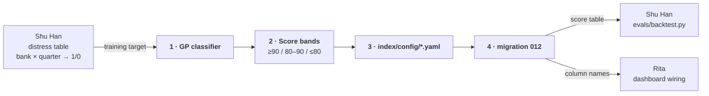

# Role guide — Ming: `index/` fundamentals axis

> Owns: turning Call Report numbers into a **per bank × quarter risk score**.
> This is one of the two axes the whole project combines. The sentiment axis
> has nothing to be compared against until this exists.

## Dependency graph

You are blocked by one thing and block two people. Both edges are **column
names**, not code — settle them in a conversation and the rest runs parallel.

Rita needs only the **names** to stop mocking — she does not need your model to
work. Tell her as soon as `012` is drafted, not when it is merged.

## Why this matters

The final claim is "text signals add something **beyond financial ratios
alone**". Your score *is* the "financial ratios alone" side. If it is weak,
the comparison is meaningless in both directions — a sentiment model that
beats a broken baseline has proven nothing.

## Blocking first step — agree the target with Shu Han

Shu Han is defining **bank × quarter → distress 1/0**, and that table is your
training target. Do not start modeling against the placeholder thresholds
floating around in chat; they were rough probes to check that any signal
exists at all.

What you two must fix together, before either of you builds:

- the table name and column names
- the key (`fdic_cert_number` + `quarter_end_date`)
- what a positive means (which quarter is labeled — the event quarter, or the
  quarters preceding it within the prediction horizon)

That last one decides the shape of your training data. Get it in writing.

## Your tasks

### 1. GaussianProcessClassifier over Call Report features

Mentor-agreed method (2026-07-12, see `index/README.md`):

- Features from `fact_call_report`: liquidity ratio, fee income ratio, loans
  vs capital, NPL ratio, and threshold-based distress indicators derived from
  descriptive analysis.
- **sklearn `GaussianProcessClassifier`** — this is specified, not a choice
  left open. If you want to compare against something else, do it as an
  addition, not a replacement.

### 2. Score bands

Mentor-agreed, three classes mirroring the sentiment side:

| Score | Band |
|---|---|
| ≥ 90 | positive (sound) |
| 80–90 | neutral |
| ≤ 80 | negative (distress signal) |

### 3. Parameters as versioned YAML

`index/config/*.yaml` — an approved design decision. Thresholds, band cutoffs,
and feature lists live there, not as literals in code. Anyone re-running the
index six months from now needs to know which parameters produced a given
number.

### 4. Migration `db/migrations/012_index_tables.sql`

The table schema is the **only** shared contract — Shu Han and Rita both read
this and never import your code. Migration numbering is sequential and
`db/migrations/CHECKSUMS` must be updated; see `RUNBOOK.md` §6 step 1.

## Traps specific to this data

- **Positives are ~0.6% of bank-quarters.** Optimizing accuracy produces a
  model that predicts "sound" every time and scores 99.4%. Use class weighting
  or calibration, and judge with the metrics Shu Han fixes.
- **Split by time, not at random.** A random split puts 2023 in training and
  2021 in test, which is not the problem we are solving.
- **Watch bank concentration.** 33 events across 24 banks out of 104 — if a
  handful of banks supply most positives, the model may be learning those
  banks rather than the pattern.
- **GaussianProcessClassifier scales poorly.** It is O(n³) in training samples.
  3,848 seed-bank quarters is fine; if you widen to the full 435k-row
  `fact_bank_quarter`, it will not finish. Subsample or stay on the seed set.

## Out of scope — deliberately

- **Do not build the evaluation.** Shu Han owns `evals/backtest.py` and the
  metric protocol. You produce scores; he grades them. Two people writing
  evaluation code produces two numbers that disagree.
- **Do not touch `scoring/` or `pipeline/`.** The sentiment axis and ingestion
  are other people's lanes; modules communicate only through tables.

## Where you touch other people

| Person | Interface |
|---|---|
| **Shu Han** | his distress table (your target) → your score table (his input). Agree names before building — that is the entire contract |
| **Rita** | the dashboard reads your `012` tables. Tell her the column names as soon as they are fixed, so she can wire mock data to the real shape |
| **Jiwon** | none until the combination step |

## Reference

- `index/README.md` — the mentor-agreed method, score bands, ownership
- `unified_ffiec_fdic_dataset/` — `fact_call_report`, `fact_bank_quarter`
- `RUNBOOK.md` §6 — how to add a migration without breaking the checksum file
- `docs/roles/shu-han.md` — why the target label is distress state, not failure
