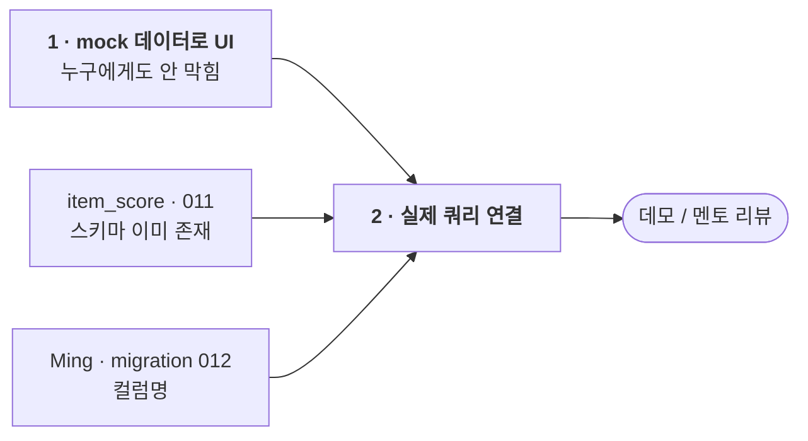

# 역할 가이드 — Rita: `dashboard/`

> 영어 원본: [rita.md](rita.md) — 두 문서가 어긋나면 영어본이 기준.

> 담당: Streamlit 앱. 팀 밖의 사람이 실제로 보는 유일한 결과물이다 — 멘토,
> 리뷰어, 데모.

## 의존성 그래프

대시보드는 아무도 막지 않는다 — 그래서 **남을 기다리며 서 있으면 안 된다.**

들어오는 간선은 Ming의 컬럼명 하나뿐이고, 그것도 2단계에서 도착한다.
1단계는 온전히 당신 것 — 당일 시작할 것.

> **완료:** `gold_slice_4`(50행 라벨)는 `main`에 머지됐고, `working-branch`에
> 딸려 있던 NewsAPI / Alpha Vantage 스캐폴딩도 제거됐다 — 두 소스는
> `scoring/DESIGN.md`(2026-07-21)에서 제외 티어로 분류됐고, 그 마이그레이션이
> 기존 `007_yfinance.sql` / `008_cfpb_complaint.sql`과 번호가 충돌했다.
> 그 브랜치에 남은 일은 없다. **대시보드가 당신 lane의 전부다.**

## mock 데이터로 만들어라 — 기다리지 마라

필요한 것 중 완성된 게 없다: 파인튜닝된 모델은 존재하지 않고, Ming의 지수
테이블도 아직 없다. **괜찮다.** UI 전체를 하드코딩하거나 랜덤 생성한
데이터로 만들고, 실제 쿼리는 마지막에 갈아끼운다.

상류를 기다리는 것이 이 작업이 늦어지는 유일한 경로다.

## 무엇을 만드나

멘토의 첫 화면 컨셉(2026-07-12)이 `dashboard/concept/`에 이미지로 있다 —
그걸 만든다. 은행을 검색하면:

1. **감성 상태** — 3클래스, 시간에 따른 추세
2. 그 감성을 만든 **두드러진 키워드** (explainability)
3. **분기별 fundamentals 리스크 프로필** — Ming의 GP 점수 밴드
   (≥90 건전 / 80–90 중립 / ≤80 부실)

두 상태가 렌더링돼야 한다:

| 상태 | 의미 |
|---|---|
| **Watch** | fundamentals 중립, 감성 부정 (Wells Fargo 예시) |
| **Elevated Risk** | 두 축이 동시에 부정 — 경고 신호의 가장 강한 구성 (Western Alliance 예시) |

`README.md`의 4단계 분류(Stable / Watch / Elevated Risk / Imminent
Disruption)가 이 둘이 나온 전체 사다리다.

## 데이터가 어디서 오나

| 패널 | 테이블 | 상태 |
|---|---|---|
| 감성 3클래스 + 확률 | `item_score` (`011_scoring_tables.sql`) | **스키마 지금 존재** — 실제 컬럼명으로 만들 것 |
| 키워드 | `item_score.keywords` | 컬럼은 있으나 **v2 — 한동안 비어 있다.** placeholder로 두고 막히지 말 것 |
| fundamentals 밴드 | Ming의 `012_index_tables.sql` | 아직 없음 — **확정되는 즉시 컬럼명을 받을 것** |
| 은행 목록 / 이름 | `bank` 테이블 (`001_bank.sql`), 104행 | 존재 |

`item_score`는 **기사당 1행**이지 은행당 1행이 아니다. 기사를 은행 × 기간으로
집계하는 일은 그 위 레이어에서 일어난다 — 그 롤업이 존재한다고 가정하고
mock하라. 대시보드 SQL에 영구적인 집으로 넣지 말 것.

## 규칙

- **읽기 전용.** 대시보드는 절대 DB에 쓰지 않는다. 예외 없음 — 읽기 전용
  소비자라는 점이 스키마가 바뀌어도 안 깨지는 이유다.
- **다른 모듈의 코드를 import하지 말 것.** 테이블이 유일한 공유 계약이다.
- **실제 쿼리를 연결하기 전에 Ming과 컬럼명을 합의할 것.** 안 그러면 데이터
  레이어를 두 번 쓰게 된다.

## 다른 사람과 만나는 지점

| 사람 | 인터페이스 |
|---|---|
| **Ming** | `012` 지수 테이블 컬럼명 — 일찍 받을 것 |
| **Jiwon** | `item_score`의 형태, 은행 × 기간 롤업이 어떻게 생겼는지 |
| **Shu Han** | 없음 — 대시보드는 평가 결과가 아니라 점수를 보여준다 |

## 참고 문서

- `dashboard/README.md` — 컨셉 렌더링, 첫 화면 설명
- `db/migrations/011_scoring_tables.sql` — `item_score` 컬럼
- `README.md` — 4단계 재무 건전성 분류
