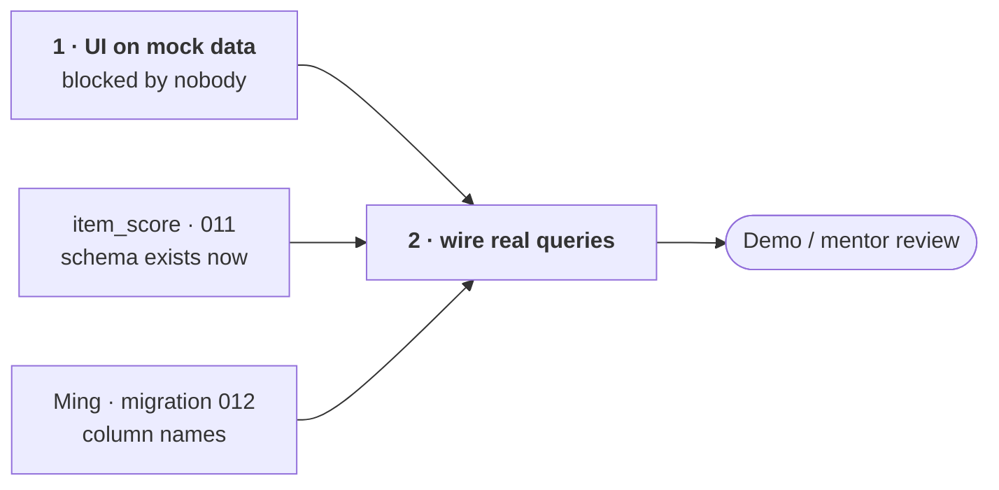

# Role guide — Rita: `dashboard/`

> Owns: the Streamlit app. This is the only part of the project anyone outside
> the team actually looks at — the mentor, the reviewers, the demo.

## Dependency graph

The dashboard blocks nobody — which is exactly why it must not sit waiting on
anyone else.

The only inbound edge is Ming's column names, and it lands at step 2. Step 1
is yours alone — start it the same day.

> **Done:** `gold_slice_4` (50 labels) is merged to `main`, and the NewsAPI /
> Alpha Vantage scaffolding that rode along on `working-branch` has been
> removed — those sources were tiered out in `scoring/DESIGN.md` (2026-07-21),
> and their migrations collided with the existing `007_yfinance.sql` /
> `008_cfpb_complaint.sql`. Nothing is outstanding on that branch; the
> dashboard is your whole lane.

## Build against mock data — do not wait

Nothing you need is finished: the fine-tuned model does not exist, and Ming's
index tables are not written yet. That is fine. Build the whole UI against
hardcoded or randomly generated data and swap in real queries at the end.

Waiting for upstream is the one way this lands late.

## What to build

The mentor's first-screen concept (2026-07-12) is already rendered as images in
`dashboard/concept/` — build those. Search a bank, then show:

1. **Sentiment state** — 3-class, with a trend over time
2. **Standout keywords** driving that sentiment (explainability)
3. **Quarter-over-quarter fundamentals risk profile**, with Ming's GP score
   bands (≥90 sound / 80–90 neutral / ≤80 distress)

Two states are illustrated and both must render:

| State | Meaning |
|---|---|
| **Watch** | fundamentals neutral, sentiment negative (Wells Fargo demo) |
| **Elevated Risk** | both axes negative at once — the strongest warning configuration (Western Alliance demo) |

The four-level classification in `README.md` (Stable / Watch / Elevated Risk /
Imminent Disruption) is the full ladder these two are drawn from.

## Where the data will come from

| Panel | Table | Status |
|---|---|---|
| sentiment 3-class + probabilities | `item_score` (`011_scoring_tables.sql`) | **schema exists now** — build against the real column names |
| keywords | `item_score.keywords` | column exists but is **v2 — it will be empty for a while**. Use a placeholder and do not block on it |
| fundamentals bands | Ming's `012_index_tables.sql` | not written yet — **ask Ming for column names as soon as he fixes them** |
| bank list / names | `bank` table (`001_bank.sql`), 104 rows | exists |

Note that `item_score` holds one row **per article**, not per bank. Aggregating
articles to a bank × period view happens above it — assume that rollup exists
and mock it; do not build it into the dashboard's SQL as a permanent home.

## Rules

- **Read-only.** The dashboard never writes to the database. No exceptions —
  a read-only consumer is the reason the schema can change without breaking it.
- **Do not import other modules' code.** Tables are the only shared contract.
- **Agree column names with Ming before wiring the real queries**, otherwise
  you will rewrite the data layer twice.

## Where you touch other people

| Person | Interface |
|---|---|
| **Ming** | `012` index table column names — get them early |
| **Jiwon** | `item_score` shape and what the rollup to bank × period looks like |
| **Shu Han** | none — the dashboard shows scores, not eval results |

## Reference

- `dashboard/README.md` — concept renderings and the first-screen description
- `db/migrations/011_scoring_tables.sql` — `item_score` columns
- `README.md` — the four-level financial health classification
