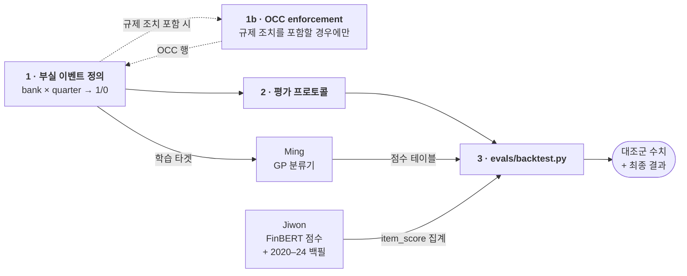

# 역할 가이드 — Shu Han: 백테스트

> 영어 원본: [shu-han.md](shu-han.md) — 두 문서가 어긋나면 영어본이 기준.

> 담당: 프로젝트 전체의 **정답지**, 그리고 그 정답지로 채점하는 하네스.
> 나머지는 전부 예측을 만들고, 이 역할은 그 예측이 좋았는지를 말해주는
> 숫자를 만든다.

## 의존성 그래프

**1번은 누구에게도 막혀 있지 않다 — 오늘 시작할 수 있다.** 아래 모든 것이
1번을 기다리므로, 빨리보다 정확히 하는 게 낫다.

읽는 법: 당신이 Ming에게 타겟을 넘기고, Ming이 점수를 돌려준다. 3번의
나이브 피처 실행 덕분에 둘 중 어느 것도 도착하기 전에 하네스를 완성할 수
있다.

## 왜 중요한가

프로젝트의 핵심 주장(README)은 비교문이다:

> 텍스트 신호가 **재무 비율만 쓸 때보다** 은행 부실을 더 일찍 잡아내는가

채점된 백테스트가 없으면 비교가 없고, 정답지가 없으면 채점이 없다. 감성
모델과 안정성 지수가 다 나와도 이게 안 나오면 캡스톤에는 결과가 없다 —
산출물만 있을 뿐이다.

## 배경: 정답 라벨을 왜 바꿨나

**은행 폐쇄(failure)를 타겟으로 쓰지 말 것.** 추측이 아니라 실측이다.

시드 은행 104곳(`db/seed/banks.csv`)을 `fact_bank_quarter`에 조인한 결과:

| | |
|---|---|
| 시드 은행 분기 행, 2017+ | 3,848 |
| `distress_within_4q = 1`, 전체 기간 | **7건** (전부 2008년, 은행 2곳) |
| `distress_within_4q = 1`, 2017+ | **0건** |

0건이다. 우리 은행들은 대형 생존 은행이고, 대형 은행은 FDIC가 문을 닫지
않는다.

**은행 목록을 넓혀도 해결되지 않는다.** 2017년 이후 실패한 27곳 중 21곳이
자산 3억 달러 미만이고, GDELT 프로브로 이들에게 사실상 뉴스가 없음을
확인했다 — Heartland Tri-State Bank는 **자기가 망한 해 1년 동안 영어 기사가
5건**이었다. 채점할 텍스트가 없으니 예측할 근거도 없다.

**대신 타겟은 폐쇄가 아니라 부실 *상태*다.** 같은 104곳에 임시 임계값을
적용하니 날짜가 찍힌 실재 사건들이 나온다:

| 사건 | 분기 수 |
|---|---|
| 예금이 전분기 대비 10% 이상 감소 | 21 |
| NPL 비율이 1.5배 이상 상승하며 2% 초과 | 12 |
| **해당 은행 수** | **104곳 중 24곳** |

2017~2024년, 33건. 쓸 만한 정답지이고, `index/README.md`가 이미 명시한
"descriptive analysis에서 도출한 min/max 임계값 기반 부실 지표"와도
일치한다.

⚠️ **위 임계값은 임시값이다.** 신호가 *존재하는지*를 확인하려고 고른 값이지
맞아서 고른 게 아니다. 확정이 1번 작업이다.

## 작업 (순서대로)

### 1. 부실 이벤트 정의 (블로킹 — 다른 사람들이 기다린다)

산출물: **은행 × 분기 → 부실 1/0** 테이블.

- 시드 104곳의 `fact_call_report`로 descriptive analysis를 돌리고 **실제
  분포를 보고** 임계값을 정한다 — 예금 유출, NPL, 자본비율, 유가증권
  미실현손실. 위 임시값을 검증 없이 물려받지 말 것.
- **규제 조치(enforcement action)를 부실 사건에 포함할지** 결정한다.
  FDIC·Fed 조치는 이미 수집 중이고(`raw_item`의 `fdic_enforcement` /
  `fed_enforcement`), 대형 은행도 실제로 받는다. 먼저 측정할 것: 104곳 중
  2017년 이후 조치를 받은 곳이 몇 곳인가? 로컬 시드 CSV는 헤더만 있으므로
  파일이 아니라 **Supabase SQL 쿼리**로 확인해야 한다.
- 정의를 근거와 함께 문서로 남긴다. 이후 나오는 모든 "이 은행이 왜 부실로
  찍혔나?" 질문이 이 문서로 돌아온다.

**검증:** 연도별 사건 수와 커버되는 은행 수. 한 은행이 사건 대부분을 만들고
있다면, 그 평가는 방법론이 아니라 그 은행 하나를 측정하는 것이다.

### 1b. OCC enforcement 수집 — 위 결정에 따라 조건부

Yusheng에게서 이관됨. 1번에서 **규제 조치를 부실 사건으로 인정하기로 한
경우에만** 진행한다. 아니면 브랜치를 닫고 건너뛴다.

이 공백은 사소하지 않다. FDIC와 Fed 조치는 수집하지만 OCC는 안 하고 있는데,
**시드 104곳 중 35곳이 국법은행(National Association)** 이다 — PNC,
JPMorgan Chase, Bank of America, Citibank, Wells Fargo, Morgan Stanley Bank,
U.S. Bank, Capital One, American Express, Fifth Third. 전부 OCC 감독
대상이라, 이 폴러가 없으면 **코퍼스를 지배하는 바로 그 은행들에 대해 규제
신호가 구조적으로 눈이 먼다.** FDIC + Fed만으로 만든 규제 기반 부실 라벨은
"대형 국법은행은 규제 조치를 받지 않는다"처럼 보이는데, 사실이 아니다.

작업은 처음부터가 아니라 거의 끝나 있다:

- **`origin/occ-v2`(2026-07-24)를 쓸 것.** `origin/yusheng/occ`(2026-07-23)가
  아니다. 최신 브랜치는 이미 poller 템플릿을 따른다 — `main()` 스켈레톤,
  watermark, 은행별 실패 격리, 양쪽 경로의 `write_heartbeat`. 오래된 쪽은
  삭제한다.
- **마이그레이션 번호를 `013_add_occ_enforcement.sql`로 바꿀 것.** 브랜치는
  현재 `012`를 쓰는데 Ming이 `012_index_tables.sql`로 가져간다. 오래된
  브랜치의 `011`은 이미 `011_scoring_tables.sql`이다.
- `db/migrations/CHECKSUMS`를 갱신하고 `raw_item.source` CHECK을 확장한다 —
  정확한 ALTER 문은 `002_raw_item.sql` 헤더에 있다.
- `.github/workflows/ingest.yml`의 `poll` 매트릭스에 `poll_occ_enforcement`
  추가 — 표시된 자리에 한 줄.

전체 체크리스트: `RUNBOOK.md` §6. 이 lane에서 `pipeline/`을 건드리는 유일한
지점이며, 규칙의 예외가 아니라 규칙 그 자체다 — 수집을 담당해서가 아니라
**그 데이터가 당신 자신의 부실 정의에 들어가기 때문에** 당신이 맡는다.

**계약:** Ming이 이 테이블을 정답으로 GaussianProcessClassifier를 학습한다.
**둘 중 누구도 작업을 시작하기 전에 컬럼명을 먼저 합의할 것.**

### 2. 평가 프로토콜 확정

- **Accuracy 금지.** 양성이 약 0.6%라 매번 "부실 아님"이라고 찍어도 99.4%가
  나온다. PR-AUC, precision@k, **고정 알림 예산 하의 recall**("분기당 은행
  10곳을 조사할 수 있다면 실제 사건 몇 건을 잡나?")을 쓴다.
- 무작위가 아니라 **시간 기준**으로 분할한다 — 앞 분기로 학습, 뒷 분기로
  검증. 무작위 분할은 미래를 학습에 새게 한다.
- 평가 구간을 **두 축이 모두 존재하는 기간**으로 제한한다. Fundamentals는
  수십 년치가 있지만 뉴스는 아니다. 감성 모델보다 넓은 구간에서 계산한
  fundamentals 베이스라인은 대조군이 아니라 다른 실험이다.

### 3. `evals/backtest.py` 작성

- 입력: 은행 × 분기 점수 시계열 + 1번의 부실 테이블.
- 조인: `bank.fdic_cert ↔ fact_bank_quarter.fdic_cert_number` — 외래키가
  없으므로 값으로 조인.
- **단일 나이브 피처로 하네스를 먼저 검증한다** (예: tier-1 자본비율을
  그대로 리스크 점수로). 하네스가 틀렸다면 움직이는 부품이 하나뿐인 지금
  발견해야 한다 — 나중에는 이상한 숫자가 모델 탓인지, 라벨 탓인지, 조인
  탓인지 구분이 안 된다.
- 그다음 Ming의 GP 점수를 끼운다. 그 실행 결과가 **대조군**이다:
  "fundamentals만 = X". 감성을 합친 실행은 맨 마지막.

## 범위 밖 (의도적으로 제외)

- **실패 은행 코호트를 만들지 말 것.** 위에서 실측함 — 뉴스가 없다.
- **GDELT 백필을 하지 말 것.** 2020~2024 백필은 Jiwon 담당이고, 과거 행은
  손으로 라벨링하는 게 아니라 파인튜닝된 FinBERT가 채점한다.
- **1b를 제외하고 `pipeline/`을 건드리지 말 것.** 백테스트는 테이블을 읽을
  뿐 수집하지 않는다. OCC 폴러는 당신의 라벨 정의에 들어가기 때문에 범위에
  포함된 것이며, `pipeline/`의 나머지는 당신 것이 아니다.

## 다른 사람과 만나는 지점

| 사람 | 인터페이스 |
|---|---|
| **Ming** | 1번의 부실 테이블(Ming의 학습 타겟)과 Ming이 만드는 점수 테이블(당신의 입력). 컬럼명 사전 합의가 계약의 전부다 |
| **Jiwon** | 감성 점수는 `item_score`에 들어가며, 결합 실행 시 은행 × 분기로 집계된다 |
| **Rita** | 직접 접점 없음 — 대시보드는 평가 결과가 아니라 점수 테이블을 읽는다 |

## 참고 문서

- `scoring/DESIGN.md` — "Backtest linkage" 절, 조인 키와 라벨 주의사항
- `index/README.md` — 멘토 합의 방법론과 점수 밴드
- `evals/README.md` — 두 종류의 라벨, 왜 섞으면 안 되는지
- `unified_ffiec_fdic_dataset/` — 본인 데이터셋
