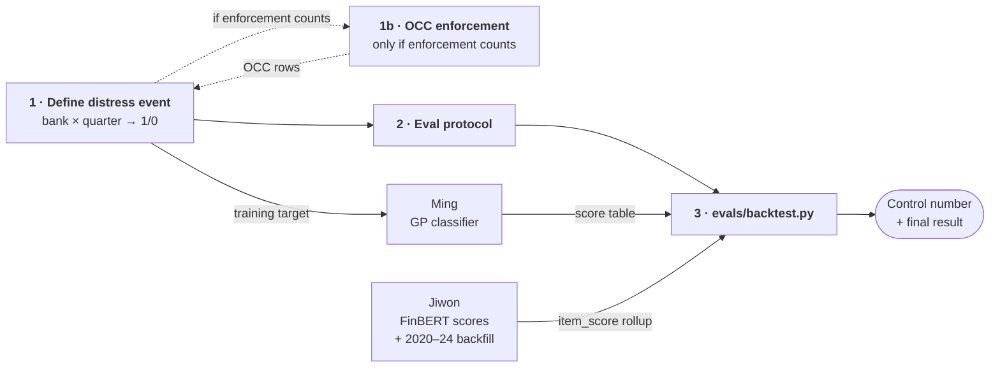

# Role guide — Shu Han: backtest

> Owns: the **answer key** for the whole project, and the harness that grades
> against it. Everything else produces predictions; this produces the number
> that says whether those predictions were any good.

## Dependency graph

**Nothing blocks task 1 — you can start today.** Everything below waits on it,
which is why it is worth doing carefully rather than quickly.

Read it as: you hand Ming a target, he hands you scores back. The naive-feature
run in task 3 lets you finish the harness before either of those arrives.

## Why this matters

The project's core claim (README) is a comparison:

> whether text-based signals improve early detection of bank distress
> **beyond financial ratios alone**

Without a graded backtest there is no comparison, and without an answer key
there is no grading. If the sentiment model and the stability index both ship
and this does not, the capstone has no result — only outputs.

## Background: why the target label changed

**Do not use bank failure as the target.** This was measured, not assumed.

Joining the 104 seed banks (`db/seed/banks.csv`) against
`fact_bank_quarter`:

| | |
|---|---|
| Seed-bank quarters, 2017+ | 3,848 |
| `distress_within_4q = 1`, all time | **7** (all 2008, 2 banks) |
| `distress_within_4q = 1`, 2017+ | **0** |

Zero. Our banks are large survivors; large banks do not get closed by the FDIC.

Widening the bank set does not fix it either. Of the 27 failures since 2017,
21 held under $300M in assets, and a GDELT probe confirmed they have
effectively no news coverage — Heartland Tri-State Bank produced **5 English
articles in the entire year it failed**. There is no text to score, so there is
nothing to predict from.

**Instead the target is a distress *state*, not closure.** A rough threshold
pass over the same 104 banks found real, datable events:

| Event | Quarters |
|---|---|
| Deposits fall ≥10% quarter-over-quarter | 21 |
| NPL ratio rises ≥1.5× and exceeds 2% | 12 |
| **Banks affected** | **24 of 104** |

33 events, 2017–2024. That is a workable answer key, and it aligns with
`index/README.md`, which already specifies "min/max threshold-based distress
indicators derived from descriptive analysis".

⚠️ **Those thresholds are placeholders.** They were chosen to test whether
*any* signal exists, not because they are right. Fixing them is task 1.

## Your tasks, in order

### 1. Define the distress event (blocking — everyone waits on this)

Produce: a table of **bank × quarter → distress 1/0**.

- Run descriptive analysis over `fact_call_report` for the 104 seed banks and
  choose thresholds from the actual distributions — deposit outflow, NPL,
  capital ratios, unrealized securities losses. Do not inherit the placeholders
  above without checking them.
- Decide whether **regulator enforcement actions** count as distress events.
  We already ingest FDIC and Fed actions (`raw_item`, sources
  `fdic_enforcement` / `fed_enforcement`), and large banks do receive them.
  Measure first: how many of the 104 banks have an action 2017+? The local
  seed CSV is header-only, so this is a SQL query against Supabase, not a file
  read.
- Write the definition down with its rationale. Every later "why is this bank
  labeled distressed?" question routes back to this document.

**Verify:** the event count per year, and how many distinct banks are covered.
If one bank supplies most events, the eval will measure that bank, not the
method.

### 1b. OCC enforcement ingestion — conditional on the decision above

Reassigned from Yusheng. Only do this **if** task 1 concludes that enforcement
actions count as distress events; otherwise close the branch and skip it.

The gap is not cosmetic. We ingest FDIC and Fed actions but not OCC, and
**35 of the 104 seed banks are national associations** — PNC, JPMorgan Chase,
Bank of America, Citibank, Wells Fargo, Morgan Stanley Bank, U.S. Bank,
Capital One, American Express, Fifth Third. Those are OCC-supervised, so
without this poller the enforcement signal is systematically blind for exactly
the banks that dominate the corpus. An enforcement-based distress label built
on FDIC + Fed alone would look like "large national banks never get enforced",
which is false.

The work is mostly done, not started from scratch:

- **Use `origin/occ-v2`** (2026-07-24), not `origin/yusheng/occ` (2026-07-23).
  The newer branch already follows the poller template — `main()` skeleton,
  watermark, per-bank failure containment, `write_heartbeat` on both paths.
  Delete the older branch.
- **Renumber the migration to `013_add_occ_enforcement.sql`.** The branch
  currently claims `012`, which Ming is taking for `012_index_tables.sql`.
  `011` (the number on the older branch) is already `011_scoring_tables.sql`.
- Update `db/migrations/CHECKSUMS` and extend the `raw_item.source` CHECK —
  exact ALTER statements are in the header of `002_raw_item.sql`.
- Add `poll_occ_enforcement` to the `poll` matrix in
  `.github/workflows/ingest.yml` — one line, marked spot.

Full checklist: `RUNBOOK.md` §6. This is the one place in your lane that
touches `pipeline/`, and it is the exception that proves the rule — you own it
because the data feeds your own distress definition, not because you own
ingestion.

**Contract:** Ming trains the GaussianProcessClassifier against this exact
table. Agree the column names with Ming before either of you builds on it.

### 2. Fix the evaluation protocol

- **Accuracy is banned.** At roughly 0.6% positives, predicting "no distress"
  every time scores 99.4%. Use PR-AUC, precision@k, and recall at a fixed
  alert budget ("if we can investigate 10 banks a quarter, how many real
  events do we catch?").
- Split by **time**, not at random — train on earlier quarters, test on later
  ones. A random split leaks the future into training.
- Restrict the evaluation window to the period where **both** axes exist.
  Fundamentals reach back decades; news does not. A fundamentals baseline
  computed over a wider window than the sentiment model is not a control, it
  is a different experiment.

### 3. Build `evals/backtest.py`

- Input: a bank × quarter score series + the distress table from task 1.
- Join on `bank.fdic_cert ↔ fact_bank_quarter.fdic_cert_number` — value join,
  there is no foreign key.
- **Validate the harness with a single naive feature first** (e.g. the tier-1
  capital ratio used directly as a risk score). If the harness is wrong, you
  find out now, while there is only one moving part — not later, when a bad
  number could equally be the model, the labels, or the join.
- Then swap in Ming's GP scores. That run is the **control**: "fundamentals
  alone = X". The combined run with sentiment comes last.

## Out of scope — deliberately

- **Do not build a failed-bank cohort.** Measured above: no news coverage.
- **Do not backfill GDELT.** Jiwon owns the 2020–2024 backfill; the historical
  rows are scored by the fine-tuned FinBERT, not labeled by hand.
- **Do not touch `pipeline/` beyond task 1b.** The backtest reads tables; it
  does not ingest. The OCC poller is scoped in because it feeds your own label
  definition — nothing else in `pipeline/` is yours.

## Where you touch other people

| Person | Interface |
|---|---|
| **Ming** | the distress table from task 1 (Ming's training target) and the score table Ming produces (your input). Agree column names up front — that is the entire contract |
| **Jiwon** | sentiment scores land in `item_score`; aggregated to bank × quarter for the combined run |
| **Rita** | none directly — the dashboard reads score tables, not eval output |

## Reference

- `scoring/DESIGN.md` — "Backtest linkage" section, join keys and label caveats
- `index/README.md` — the mentor-agreed method and score bands
- `evals/README.md` — the two kinds of labels, and why they must not be mixed
- `unified_ffiec_fdic_dataset/` — your own dataset; `fact_bank_quarter`,
  `fact_call_report`, `fact_distress_event`
