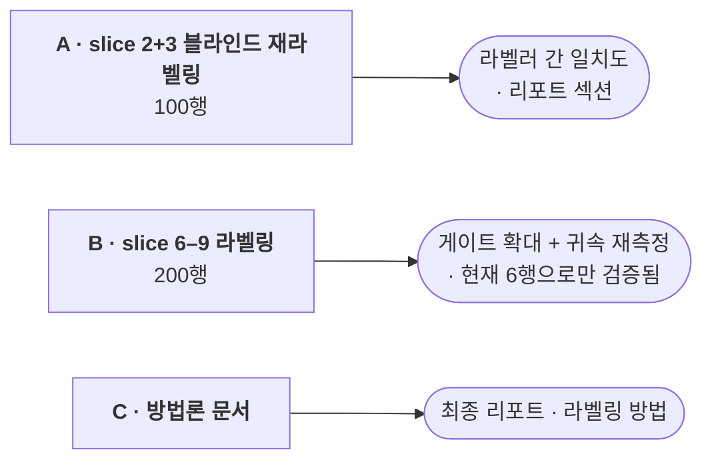

# 역할 가이드 — Yusheng: 라벨 검증 + 방법론

> 영어 원본: [yusheng.md](yusheng.md) — 두 문서가 어긋나면 영어본이 기준.

> 담당: **휴먼 라벨 자체를 검증하는 일.** LLM이 기사 8,360건을 라벨링했고
> 다섯 명이 그중 250건을 손으로 라벨링해 검사 장치로 삼았다. 그런데
> **사람들끼리 서로 일치하는지는** 아직 아무도 확인하지 않았다. 그게 이
> lane이다. 코드 없음.

## 왜 중요한가

품질 게이트는 Llama 라벨을 휴먼 라벨과 비교하고, 휴먼 쪽을 정답으로
취급한다. 그 전제는 한 번도 검증된 적이 없다. 같은 기사 50건을 읽은 신중한
두 사람이 30% 불일치한다면, "휴먼과 85% 일치"라는 숫자는 보이는 것과 다른
의미가 된다 — 천장을 정하는 건 모델이 아니라 **사람의 일관성**이다.

라벨링 연구가 **라벨러 간 일치도(inter-annotator agreement)** 를 보고하는
이유가 정확히 이것이고, 우리에겐 지금 없다. 방법론 섹션의 실제 공백이며, 이
lane이 메운다.

## 의존성 그래프

크리티컬 패스에서 이 lane을 기다리는 것은 없다. 여기의 모든 작업은 단계를
여는 게 아니라 **천장을 올린다** — 게이트는 어느 쪽이든 250행으로 결론 난다.

`docs/roles/shu-han.ko.md`와 비교해 보면 거기는 1번이 두 사람을 막는다. 이
lane은 **의도적으로 누구의 일정으로도 나가는 간선이 없다** — 편한 속도로
하면 된다.

## 작업

### A. `gold_slice_2`·`gold_slice_3` 블라인드 재라벨링 — 100행

Jiwon이 같은 기사 100건을 `label` 칸을 **비운** CSV로 넘긴다. 새로
라벨링한다.

**기존 라벨을 먼저 보지 말 것.** 그게 핵심이다 — 남의 답을 보면 대체로
동의하게 되고, 그렇게 만든 일치율은 일관성이 아니라 앵커링을 측정한다.
독립적으로 라벨링하면 Jiwon이 원래 결과와의 Cohen's kappa를 계산한다.

두 슬라이스 모두 `main`에 이미 완전히 라벨링돼 있으므로 하류에서 기다리는
것은 없다 — **존재하지 않던 측정치를 추가하는 일**이다.

### B. `gold_slice_6` ~ `gold_slice_9` 라벨링 — 200행

미라벨 코퍼스에서 나온 새 행들로, **방향성 있는 행**(Llama가 positive나
negative로 찍은 행) 위주로 층화한다. 대가를 치르는 건 잘못된 방향성
라벨이다 — 잘못된 `neutral`은 엉뚱한 데로 밀 방향 자체가 없다.

게이트가 250 → 450행으로 넓어지고, 현재 **6행으로 검증된** 은행 귀속 규칙이
재측정된다.

### C. 라벨링 방법론 섹션 초안

최종 리포트용: 프롬프트 버전, 슬라이스 구성 방식, 검증 절차, 불일치 처리,
그리고 A에서 나온 일치도 수치. 불명확한 부분은 Jiwon에게 물으면 된다.

## 라벨링 방법

먼저 `scoring/labeling_guide.ko.md`를 읽을 것. 절대 규칙 4개, 자주 놓치는
순서대로:

1. **이 기사의 주체가 은행인가?** 아니면 → `neutral`. 아무리 자극적인
   뉴스여도 마찬가지. 은행이 **언급**된 게 아니라 은행에 **대한** 기사여야
   한다. 비은행 기업, 주가지수, 뭉뚱그린 "대출기관"이면 `neutral`. 국적은
   무관 — 미국 은행이 아니어도 은행이면 은행이다.
2. **"말투"가 아니라 "은행 리스크 방향"** 으로 판단한다.
3. **기사 텍스트만 보고** 판단한다 — 나중에 어떻게 됐는지 찾아보지 말 것.
4. 정말 헷갈리면 → `neutral`, 그리고 왜 헷갈렸는지 한 줄 코멘트.

규칙 1이 가장 흔한 실수를 잡는다: `"JPMorgan cuts Redwood Trust price
target"`은 `neutral`이다. 은행이 주체가 아니라 분석하는 쪽이기 때문이다.

**대충 단 라벨은 라벨이 없는 것보다 나쁘다** — 이 행들이 나머지 전부를 재는
자다.

## 이 lane의 규칙

- **코드 금지.** 작업이 Python이나 SQL 편집으로 변하면 멈추고 넘길 것.
- 라벨 CSV는 데이터다 — 포맷을 바꾸거나 정렬하거나 컬럼 순서를 바꾸지 말 것.
  이 파일의 diff에는 라벨만 보여야 한다.
- 슬라이스 하나당 PR 하나.

## 다른 사람과 만나는 지점

| 사람 | 인터페이스 |
|---|---|
| **Jiwon** | 비운 CSV를 내보내고, 돌아온 결과로 일치도 통계를 계산한다 |

## 참고 문서

- `scoring/labeling_guide.ko.md` — 라벨링 규칙과 예시 (영어본
  `labeling_guide.md`가 기준)
- `evals/README.md` — 감성 라벨과 부실 라벨은 다른 것이며 섞으면 안 되는 이유
- `evals/items/` — 슬라이스들
