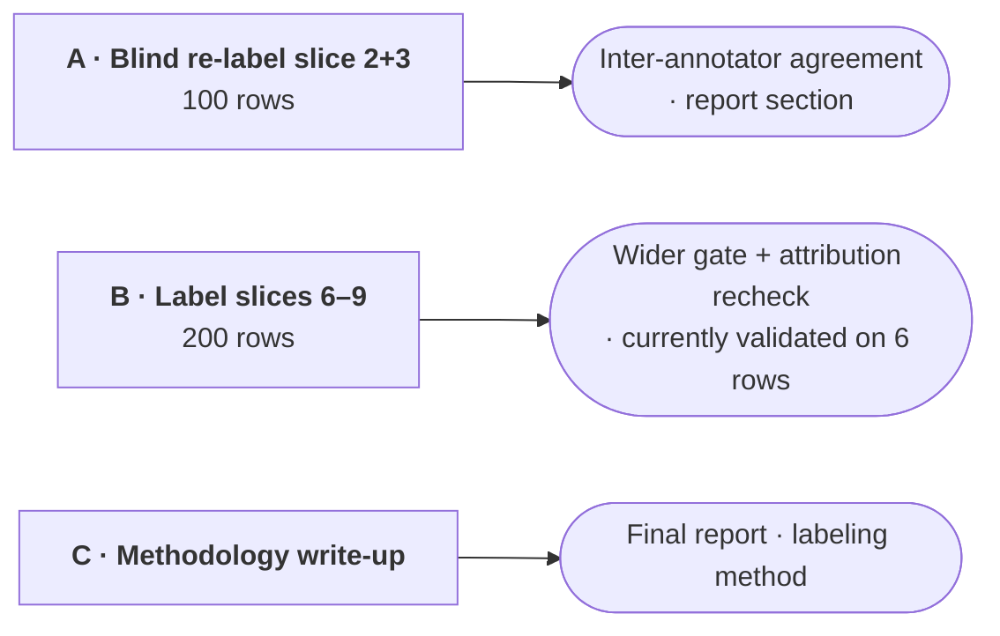

# Role guide — Yusheng: label verification + methodology

> Owns: **verifying the human labels themselves**. An LLM labeled 8,360
> articles and five people hand-labeled 250 of them as the check. Nobody has
> yet checked whether *the humans* agree with each other. That is this lane.
> No code.

## Why this matters

The quality gate compares Llama's labels against human labels and treats the
human side as ground truth. That assumption has never been tested. If two
careful people reading the same 50 articles disagree 30% of the time, then a
"85% agreement with humans" number does not mean what it appears to mean —
the ceiling is set by human consistency, not by the model.

Labeling studies report **inter-annotator agreement** for exactly this reason,
and ours currently has none. It is a real gap in the methodology section, and
it is yours to close.

## Dependency graph

Nothing on the critical path waits on this lane. Everything here **raises the
ceiling** rather than unblocking a step — the gate concludes at 250 rows
either way.

Compare with `docs/roles/shu-han.md`, where task 1 blocks two other people.
This lane deliberately has no outbound edges into anyone's schedule — work at
whatever pace suits you.

## Your tasks

> **Status 2026-08-07.** What actually happened: slices 1–5 were *reviewed*
> (the reviewer saw the existing labels) and slice 6 was labeled fresh. A
> review is not a blind second pass, so task A's measurement does not exist
> and cannot be recovered from it — anchoring is exactly what a reviewer who
> sees the first answer produces. Treat A below as **not done** if the team
> still wants an IAA number; otherwise the final report must say the project
> has no inter-annotator statistic rather than implying one. Slice 6 did its
> job for the gate: it doubled the human `negative` rows and confirmed the
> labeler's `negative` precision problem is structural.

### A. Blind re-label `gold_slice_2` and `gold_slice_3` — 100 rows

Jiwon hands you a CSV of the same 100 articles with the `label` column
**blanked**. Label them fresh.

**Do not look at the existing labels first.** That is the whole point: if you
see someone else's answer you will mostly agree with it, and an agreement
number produced that way measures anchoring, not consistency. Label
independently, then Jiwon computes Cohen's kappa against the original pass.

Both slices are already fully labeled on `main`, so nothing downstream is
waiting — this adds a measurement that does not exist yet.

### B. Label `gold_slice_6` through `gold_slice_9` — 200 rows

New rows from the unlabeled corpus, stratified toward **directional** rows
(the ones Llama marked positive or negative). Wrong directional labels are the
ones that cost something; a wrong `neutral` has no direction to push anywhere.

This widens the gate from 250 to 450 rows, and re-measures the bank-attribution
rule — which is currently validated on **6 rows**.

### C. Draft the labeling methodology section

For the final report: prompt version, how slices were constructed, the
verification procedure, how disagreements were handled, and the agreement
numbers from A. Jiwon can supply the details for anything unclear.

## How to label

Read `scoring/labeling_guide.md` first. The four absolute rules, ordered by how
often they get missed:

1. **Is the bank the subject of the article?** If not → `neutral`, however
   dramatic the news. Mentioned ≠ about. A non-bank company, a stock index, or
   a vague "lenders" → `neutral`. Nationality does not matter — a non-US bank
   is still a bank.
2. Judge **bank risk direction**, not tone.
3. Judge from the **article text alone** — do not look up what happened later.
4. Genuinely unsure → `neutral`, plus a one-line comment on why.

Rule 1 catches the most common failure: `"JPMorgan cuts Redwood Trust price
target"` is `neutral`, because the bank is the analyst, not the subject.

**A careless label is worse than no label** — these rows are the yardstick
everything else is measured against.

## Rules for this lane

- **No code.** If a task turns into editing Python or SQL, stop and hand off.
- Label CSVs are data — do not reformat, sort, or reorder columns. Diffs on
  these files should show labels and nothing else.
- One slice per PR.

## Where you touch other people

| Person | Interface |
|---|---|
| **Jiwon** | he exports the blanked CSVs and computes the agreement statistics from what you return |

## Reference

- `scoring/labeling_guide.md` — labeling rules and worked examples
  (`labeling_guide.ko.md` is the Korean translation; English is canonical)
- `evals/README.md` — why sentiment labels and distress labels are different
  things and must never be mixed
- `evals/items/` — the slices
