# EDA — Ming 负责的数据源(CFPB投诉、股价、FRED宏观)【中文版】

> 内部讨论用中文版;对外分享用英文版 `ming_sources_eda.md`。

这份补上 Jiwon 那份 `2026-07-16_ingest_eda.md` **漏掉的3张表**:`cfpb_complaint`、
`market_daily`、`fred_observation`(他那份只覆盖了 `raw_item` 文本语料 + 基本面)。
CFPB 数字来自**全历史本地提取**(约121万条匹配投诉,2011–2026);价格/FRED 来自线上库。

**分析视角**:每个源都当作**未来"每家银行风险/舆情分数"的一个输入分量**来看,评三件事——
(a)**覆盖度**:哪些银行数据够、能打分;(b)**信号**:动不动、动得有没有意义;
(c)**可解释性**:能不能拆成人能看懂的驱动因素。

---

## 1. CFPB 消费者投诉

**覆盖度 —— 偏向大型、面向消费者的银行**
- 104家里 **92家**有投诉;30家 ≥1000条,22家 <100条(太薄,打分不可靠)。
- **前10家占了全部投诉的87%**(BofA 18万、Wells 16.8万、JPM 16.8万、Cap One 16.1万、
  Citi 13.4万、Synchrony 7.9万、Amex 5.7万、USB 4.8万、**PNC 3.1万**、Ally 2.9万)。
- 商业/区域银行几乎没有(Western Alliance 约0条/月)—— CFPB 是**消费者**投诉,
  所以只能给**面向消费者的银行**打分。

**投诉量信号 —— 强,且2020年以来涨了2.6倍**
- 2012–2020 平稳在 ~5千/月,之后加速:2020年7.1万 → 2023年11.7万 → 2025年18.2万/年
  (全行业激增,主要是信用报告类)。→ 投诉量是活的信号,但**必须按银行规模归一化**
  (绝对量被银行大小主导)。

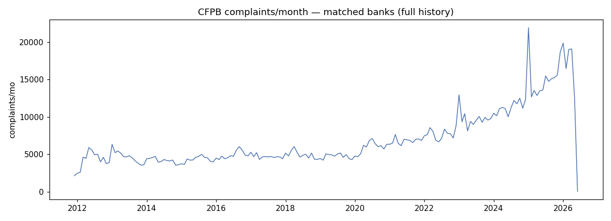

**类别构成 —— 可解释性维度**
- 产品:支票/储蓄 21%、信用卡 16%、房贷 15%、信用报告 ~16%。
- 问题:账户管理 13%、报告信息有误 8.5%、贷款修改/止赎 5.4%。
- → 分数变动可以归因到具体类别("这家分数升高,是房贷服务类投诉激增拉动的")。

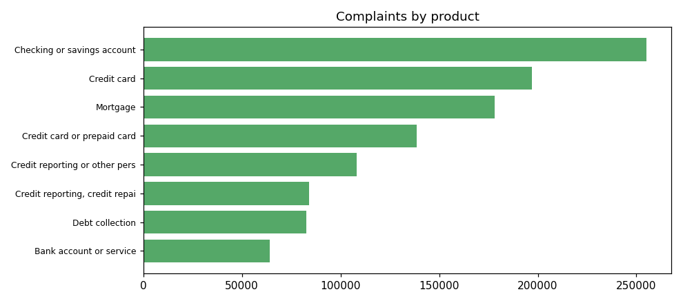

**投诉正文 —— 约46.6万条可用,喂给 BERT/情感这条轨**
- 整体38%有正文;成熟年份43–54%,2026年只有21%(CFPB 正文要**延迟几个月**才公开)。
  正文长度中位数 893 字符。
- → 训练情感模型的文本**量很充足**,但**新投诉当下没正文**,所以**文本(情感)信号
  比投诉量信号滞后约几个月**。

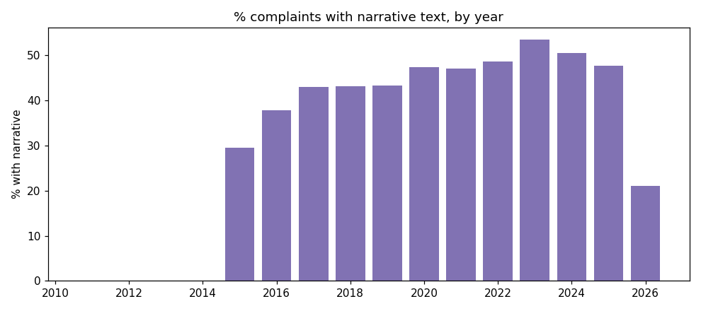

**公司响应行为**:74% "已解释结案"、12% 金钱补偿、11% 非金钱补偿、1.2% 无补偿;
及时响应99%(区分度低)。补偿类型是个弱的"解决质量"信号。

**投诉正文关键词 —— 每家银行在抱怨什么(可解释性的核心)**

整体上,投诉正文高频词是 card / payment / money / charge / dispute / fraud —— 主要围绕
**卡、支付、扣费、纠纷、欺诈**:

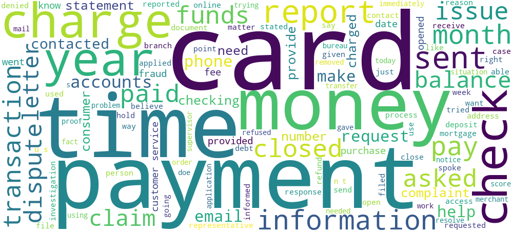

更有价值的是**每家银行的"特色关键词"**:用 TF-IDF 跨银行提取(并**剔除各家自己的名字**),
剩下的就是**区别于其他家的独特主题**,直接揭示每家投诉集中在哪条业务线:

| 银行 | 特色关键词(TF-IDF) | 揭示的业务/主题 |
|---|---|---|
| wfc Wells Fargo | assistance center, **hamp**, everyday checking, safe deposit box | 房贷修改(HAMP)、支票、保险箱 |
| bac Bank of America | **countrywide**, **lynch**(美林), identity theft, flood insurance | 房贷遗留(Countrywide)、身份盗窃 |
| jpm Chase | **sapphire**, amazon, **freedom**, marriott | 联名信用卡(Sapphire/Freedom/Amazon) |
| cof Capital One | **auto finance**, walmart, efta requires, timely access | 汽车贷款、Walmart卡、电子转账争议 |
| citi Citi | **best buy**, **home depot**, wayfair | 零售联名卡(Best Buy/Home Depot) |
| syf Synchrony | **paypal, amazon, lowes, walmart, store card** | 零售店卡(整条业务线) |
| axp Amex | bluebird, membership rewards, platinum, delta | 高端卡/积分/Delta联名 |
| usb U.S. Bancorp | fidelity, visa gift, **unemployment benefits**, cardmember | 预付/礼品卡、失业救济金卡 |
| ally Ally | **auto finance, leased, gap insurance, buyout**, scams | 汽车贷款/租赁(主业)、欺诈 |
| pnc PNC | **virtual wallet**, national city, link accounts, escrow | 自家Virtual Wallet产品、账户关联 |
| tfc Truist | **service finance, solar, installation**, obligor | 太阳能/家装分期(Service Finance) |
| gs Goldman | **apple card**, apple, marcus | Apple Card + Marcus消费金融 |

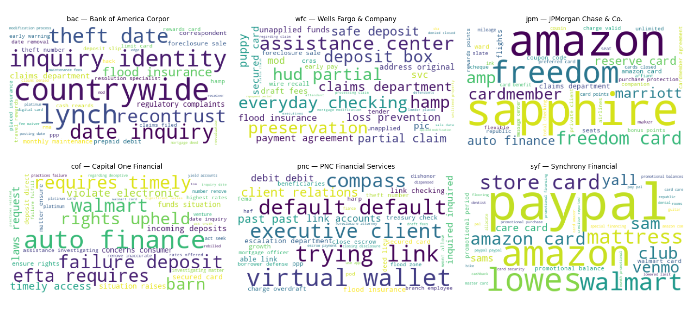

→ **这正是 dashboard 可解释性的基础**:不只给一个风险/舆情分数,还能说清"这家银行的
负面/风险主要来自哪块业务"(比如 Wells Fargo 的房贷服务、Ally 的汽车贷款、Synchrony 的
零售店卡)。后续 BERT 情感分 + 类别标签,就能把"分数"拆成"哪类投诉、什么情感"的可解释驱动。

**投诉话题随时间的演变 —— 不同话题走在不同时钟上**

把投诉按话题(产品类别)拆开看时间趋势,会发现**各话题的动态完全不同**,一个笼统的总量会把这些抹平:
- **房贷**:2013年见顶(止赎危机余波),之后**一路下降**(2024仅 ~1200/季)
- **信用报告**:2012年几乎为0 → **2020年后爆发**,2025峰值 ~12400/季
- **信用卡 / 支票储蓄**:稳步增长
- **欺诈/诈骗类问题**:2018年 775/年 → 2024年 2944/年(**约4倍**)——一个与风险高度相关、且在上升的话题

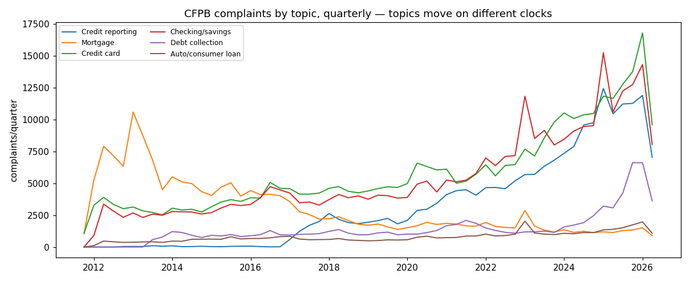

从"构成占比"看更明显:投诉的**话题结构在持续漂移**(房贷退场,信用报告/账户类上升):

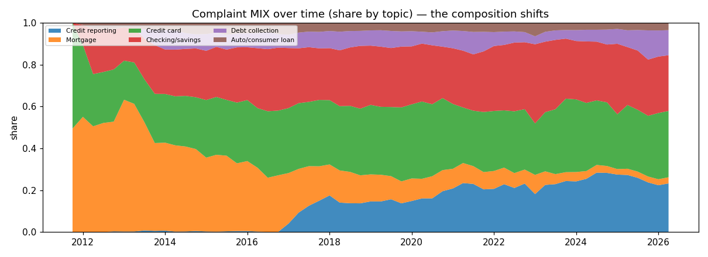

→ 对建模的启示:**话题级信号比笼统的正/负情感或总量信息量大得多**。同样是"投诉变多",
可能是房贷服务问题、也可能是欺诈激增——两者的风险含义完全不同。CFPB 自带话题分类,
是做**话题级情感/信号**的天然载体。

---

## 2. market_daily(股价 / 市场端风险)

**覆盖度 —— 密集(这是它的差异化价值)**:103/104家有 ≥5年日线,回溯到2008。
和新闻/投诉不同,**价格信号能给每一家银行打分**,包括小的商业银行。

**信号能正确指向真实困境**:3年指标——年化波动率中位0.30;最惨回撤 FLG −0.80
(Flagstar/NYCB)、LOB −0.54、SOFI −0.53;波动最大 SOFI、FLG、WAL(Western Alliance)
—— **正是2023–24区域银行危机里真出事的那几家**。回撤/波动天然可解释。

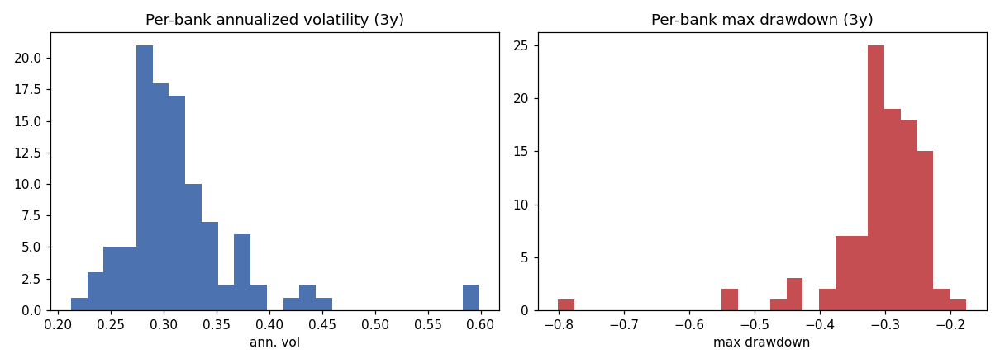

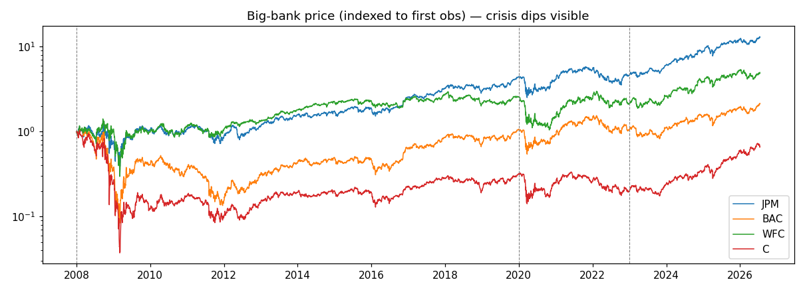

---

## 3. fred_observation(宏观背景)

5个指标,深历史(10年-联邦基金利差回到1962)。金融压力指数、高收益债利差、
10年-联邦基金利差都在 2008/2020/2023 尖峰。定位:**系统性风险背景 / 共同乘子**,
不是逐家银行的信号(宏观压力高时,所有银行风险整体抬升)。

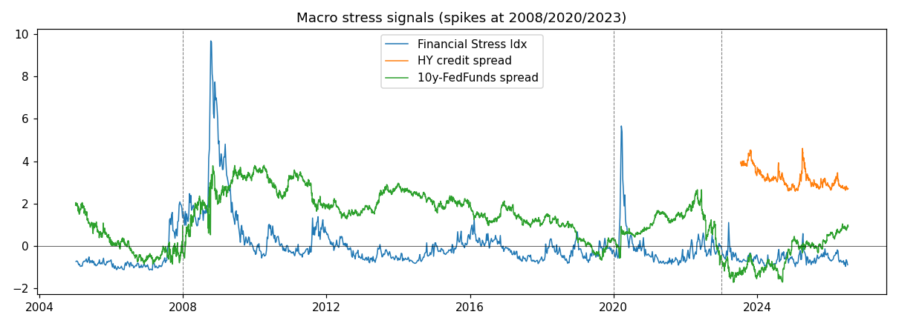

---

## 4. 这些信号和"困境"的关系:领先性与互补性

### 4.1 领先性 —— 投诉是"反应型",股价是"领先型"

用两个真实事件做自然实验,看这些信号能不能提前预警困境。

**案例A — Wells Fargo 2016 假账户丑闻(2016-09公布)**
丑闻前投诉平稳在 ~770/月,**直到丑闻公布当月(2016-09)才猛跳到 1590(2.1倍)**,之后回落。
→ 投诉是**跟着丑闻公开"反应",不领先**(消费者往往看到媒体报道后才去投诉,天生滞后)。

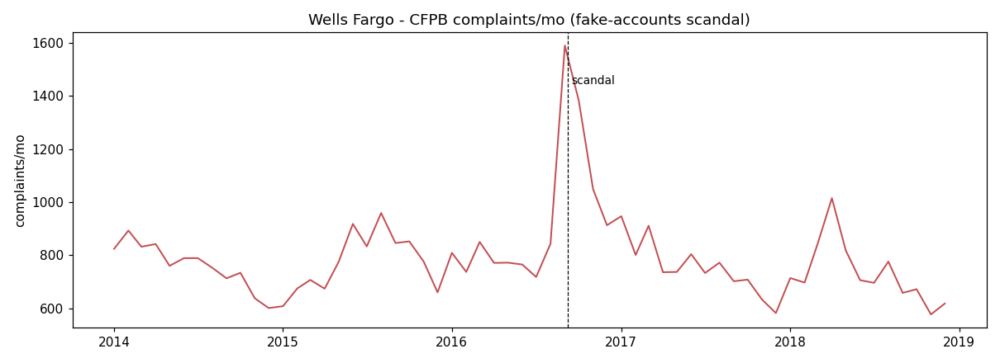

**案例B — 2023 区域银行危机(SVB 2023-03 倒闭)**

| 银行 | 股价回撤(3-5月) | 投诉量变化(vs 2022) |
|---|---|---|
| Western Alliance | **−74%** | 35x(但基线~0,是噪声) |
| Zions | **−61%** | 12x(基线~6/月,噪声) |
| KeyCorp | **−52%** | 仅 1.3x |
| Citizens | **−40%** | 仅 1.3x |

股价**几天内暴跌40-74%**,而有实际投诉量的银行(KeyCorp/Citizens)投诉**只涨1.3倍**。
→ **股价快速领先/同步反应,投诉几乎没动**——因为这是**偿付能力/挤兑**危机,不是消费者行为问题。

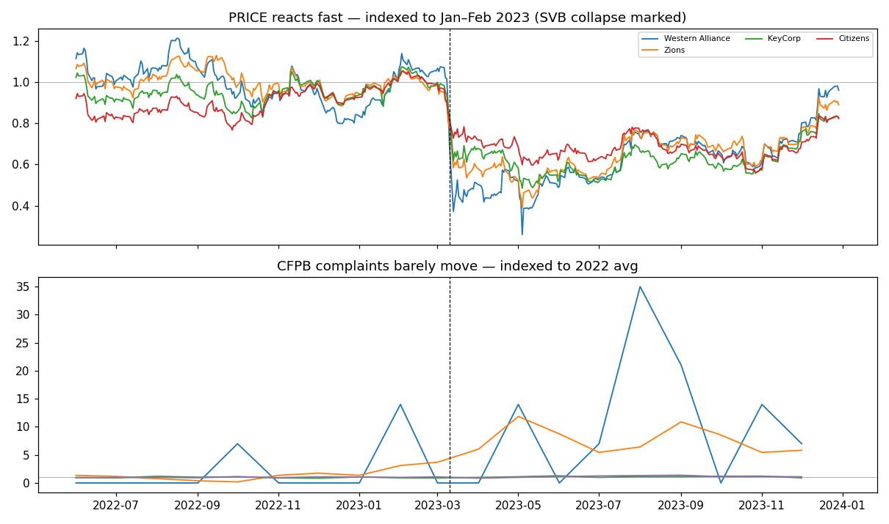

**小结:**
- **投诉量 = "反应型 / 严重度"信号**:对已公开的**消费者行为**事件有效(严重度确认,如Wells 2.1倍且持续),
  但**不领先**、对**偿付能力**危机几乎无反应。
- **股价 = "领先 / 市场端"信号**:反应最快、覆盖全部银行。
- → 分工明确:**股价当"领先"分量,投诉当"行为风险 / 严重度"分量**。
- *方法论边界*:2个案例研究给方向性证据;严谨需 event-study 跨多事件做领先-滞后统计。

### 4.2 互补性 —— 投诉/股价 与 基本面几乎不相关,各带独立信息

把每家银行的**我方信号**(投诉率、股价回撤、波动)和**基本面**(NPL、Tier1资本、流动性)
放一起,算跨银行相关性(104家全部 join 上,`bank.fdic_cert → fact_bank_quarter`):

| 我方信号 | vs NPL | vs Tier1资本 | vs 流动性 |
|---|---|---|---|
| 投诉率(按资产归一) | 0.18 | −0.11 | 0.06 |
| 股价回撤 | −0.01 | 0.16 | 0.16 |
| 股价波动 | 0.16 | −0.19 | −0.18 |

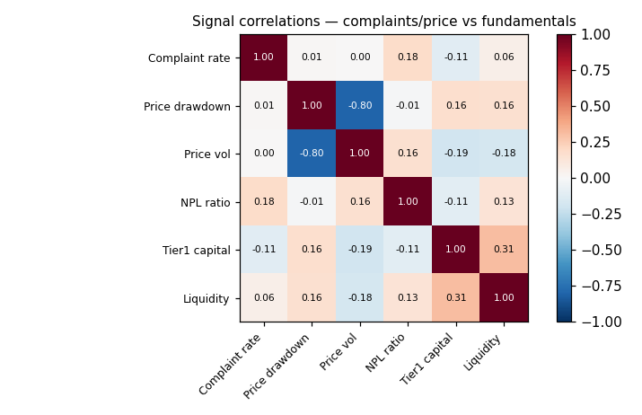

- 我的3个信号 与 基本面之间**相关性全部很低(|corr| ≤ 0.19)**;唯一的强相关是内部的
  (回撤 vs 波动 −0.80、资本 vs 流动性 0.31)。
- → **投诉/股价信号占据和基本面不同的"信息空间",不是冗余,而是补充**。把它们加进
  只有基本面的模型,有望带来纯基本面看不到的信息(而且:基本面是**季度、滞后**,股价是**每日、领先**)。
- *边界*:低相关是"不冗余"的证据;"能否真提升预测"仍要靠实际模型验证。

---

## 5. 汇总:对"评分dashboard"最关键的几条

1. **覆盖度是互补的,不是均匀的 —— 决定分数怎么组合。**
   价格=全部银行;投诉=大型消费银行;新闻=只有大行。所以分数应该
   **按每个分量在这家银行的可得性来加权**:一家小商业银行主要靠"价格+基本面"打分;
   一家大消费银行才能上"情感+投诉+价格"全套。

2. **distress标签和我们的银行几乎不重叠。**
   FDIC失败的全是小社区银行,我们top-100里~0家出现。→ 印证了要**把标签扩展到
   "近困境"**(执法动作、严重暴跌),而这些事件**我们自己的执法数据+价格回撤数据能提供**。

3. **投诉是"反应型"信号,股价才"领先"。**
   Wells 2016投诉在丑闻公布当月才跳(不提前);2023危机股价暴跌40-74%而投诉没动。
   → **股价当"领先"分量,投诉当"消费者行为风险 / 严重度"分量**,各司其职。

4. **我方信号与基本面几乎不相关(|corr|≤0.19),是补充不是冗余。**
   投诉率 / 股价回撤 / 波动 都独立于 NPL / 资本 / 流动性 → 加进纯基本面模型有望带来新信息
   (而且基本面**季度、滞后**,股价**每日、领先**)。

5. **话题级 > 笼统。**
   各投诉话题走在不同时钟上(房贷2013后降、信用报告2020后爆发、欺诈约4倍增)。
   同样"投诉变多"含义可能完全不同 → 话题级的信号 + 情感,信息量远大于一个总量。

6. **文本信号天生滞后。**
   ~46.6万条正文很适合训练,但新投诉几个月内没正文 —— **情感信号本质上比投诉量信号
   延迟几个月**(dashboard要实时打分时要注意这点)。

---

*图表已内联在上文各节;原图在 `eda/charts/` 下。*
